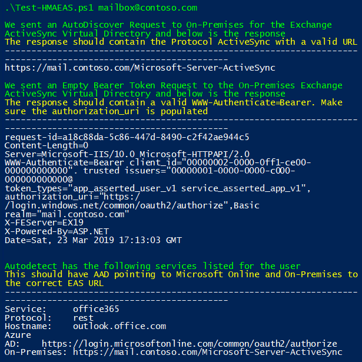
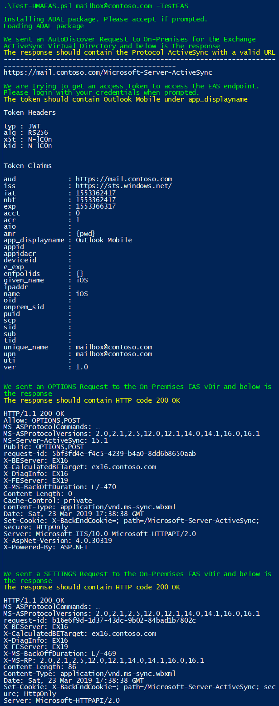

# Validating Hybrid Modern Authentication setup for Outlook for iOS and Android

This script allows you to check and see if your on-premises Exchange environment is configured correctly to use Hybrid Modern Authentication (HMA) with Outlook for iOS and Android. For this to work correctly, you will need to enable HMA and follow HMA Outlook for iOS and Android guidance to configure this feature properly.

To run the script, at minimum you will need a valid SMTP Address for a user that is located on-premises.

To test basic AutoDiscover and a Empty Bearer Authorization check you can run: 
`.\Test-HMAEAS.ps1 user@contoso.com`

To test basic AutoDiscover with a custom AutoDiscover Name and also do Empty Bearer Authorization check you can run: 
`.\Test-HMAEAS.ps1 user@contoso.com -CustomAutoD autodiscover.contoso.com`

To test basic EAS Connectivity you can run (you will need to use the users credentials for this test): 
`.\Test-HMAEAS.ps1 user@contoso.com -TestEAS`

