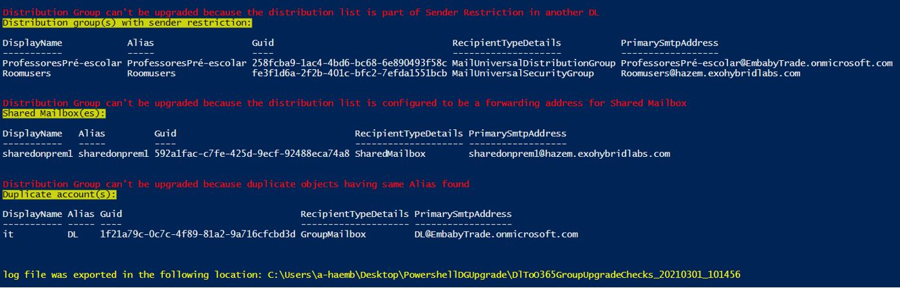
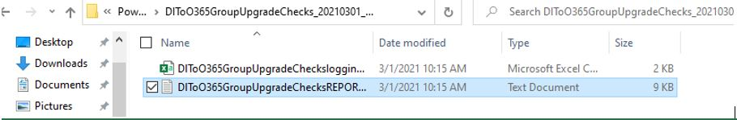

# [DLT365Groupsupgrade.ps1](https://github.com/microsoft/CSS-Exchange/releases/latest/download/DLT365Groupsupgrade.ps1)

## Validating Distribution group eligibility for upgrade to Microsoft 365 Group

This script allows you to check Distribution to Microsoft 365 Group migration eligibility for a specific distribution group SMTP, for more information over the Distribution to Microsoft 365 Group migration blockers please check: https://docs.microsoft.com/en-us/microsoft-365/admin/manage/upgrade-distribution-lists?view=o365-worldwide

Download the latest release here: [https://github.com/microsoft/CSS-Exchange/releases/latest/download/DLT365Groupsupgrade.ps1](https://github.com/microsoft/CSS-Exchange/releases/latest/download/DLT365Groupsupgrade.ps1)

The script will prompt for global administrator username & password to connect to EXO
Then the script will ask for required group smtp
Then start to check and provide feedback in case group migration blockers found as illustrated below:

