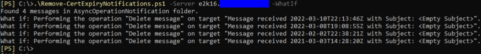
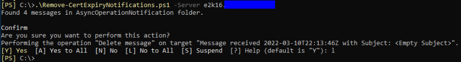
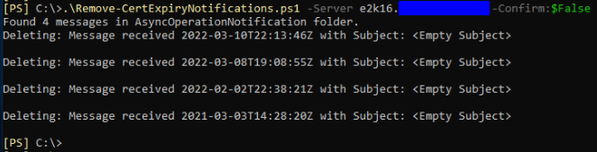
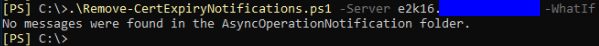

# Remove-CertExpiryNotifications

Download the latest release: [Remove-CertExpiryNotifications.ps1](https://github.com/microsoft/CSS-Exchange/releases/latest/download/Remove-CertExpiryNotifications.ps1)

This script deletes all AsyncOperationNotification items from the Exchange SystemMailbox that contains them. This corrects the BlockedDeserializeTypeException error described in [KB5013118](https://support.microsoft.com/kb/5013118).

NOTE: This script only supports Exchange 2016 and Exchange 2019. It will not work on Exchange 2013.

## Syntax

```powershell
Remove-CertExpiryNotifications.ps1
  [-Server <string>]
  [[-Credential] <PsCredential>]
  [-WhatIf]
  [-Confirm]
```

## Usage

NOTE: If an error occurs please see [Common Errors](#common-errors).

The user running the script must be granted full access to the arbitration mailbox prior to running the script. That can be accomplished with this command:

```powershell
Get-Mailbox -Arbitration "SystemMailbox{e0dc1c29-89c3-4034-b678-e6c29d823ed9}" | Add-MailboxPermission -User SomeAdmin -AccessRights FullAccess
```

Next, the same user that was granted access should run the script from Exchange Management Shell. Start by running the script with -WhatIf. Optionally, the -Credential switch can be provided. Otherwise, the current user will be used.

```powershell
.\Remove-CertExpiryNotifications.ps1 -Server exch1.contoso.com -WhatIf
```

If this succeeds, it will list all the messages that would be deleted. The output should look something like this:



To remove the messages, the script can be run without -WhatIf:

```powershell
.\Remove-CertExpiryNotifications.ps1 -Server exch1.contoso.com
```

This syntax will cause it to prompt for each message:



Or, the script can be run with -Confirm:$false to skip the prompts:

```powershell
.\Remove-CertExpiryNotifications.ps1 -Server exch1.contoso.com -Confirm:$false
```



After the script has run successfully, it should report that there are no messages present in the folder:



Finally, remember to remove the permission that was granted to the user:

```powershell
Get-Mailbox -Arbitration "SystemMailbox{e0dc1c29-89c3-4034-b678-e6c29d823ed9}" | Remove-MailboxPermission -User SomeAdmin -AccessRights FullAccess
```

## Common errors

```powershell
Invoke-RestMethod : The underlying connection was closed: An unexpected error occurred on a send.
```

"Unexpected error occurred on a send" usually means that the name in the certificate on the target server does not match what was specified in the -Server parameter. In other words, navigating to `https://the.server.you.specified/owa` must not return a certificate error. If it does, the script will fail. The specified server must be the name in the certificate bound to IIS.

```powershell
Invoke-RestMethod : The remote server returned an error: (401) Unauthorized.
```

This can occur if the user running the script does not have full access to the mailbox. Be sure the Add-MailboxPermission command was successful.

This can also occur if the server name specified is the local server, due to the loopback check. This can be resolved by passing a different name.
