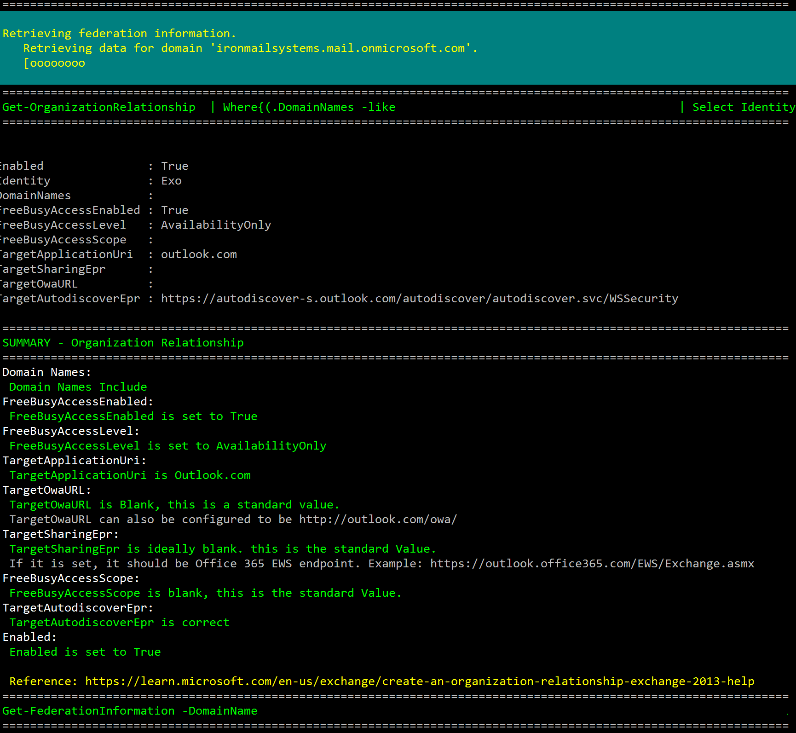
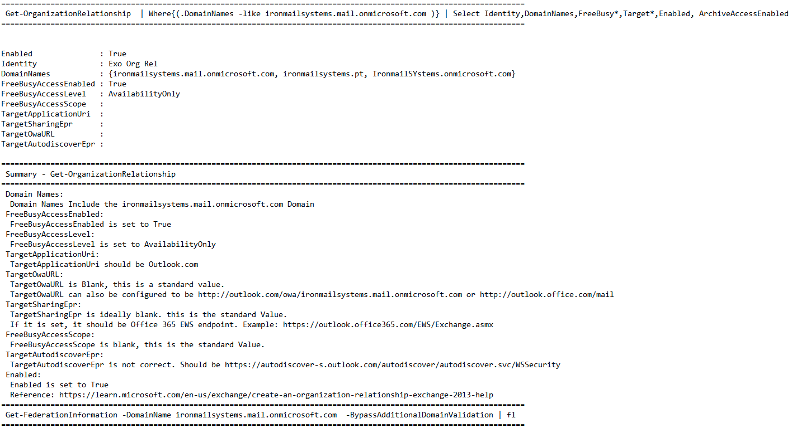
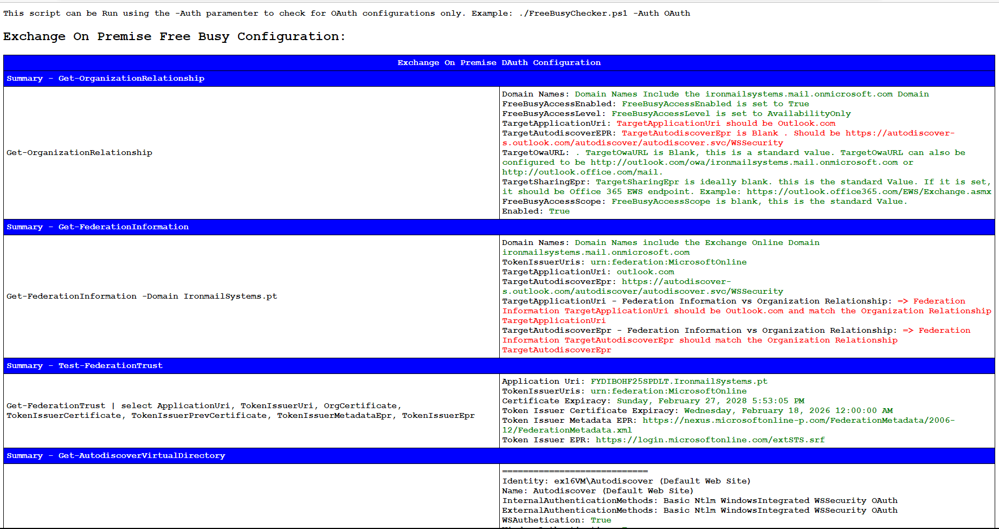

# Hybrid-Free-Busy-Configuration-Checker

View this Project at GitHub! [GitHub Repository](https://github.com/microsoft/CSS-Exchange/Diagnostics/FreeBusyChecker)

Download the latest release: [FreeBusyChecker.ps1](https://github.com/microsoft/CSS-Exchange/releases/latest/download/FreeBusyChecker.ps1)

To Provide Feedback about this tool: [Feedback Form](https://forms.office.com/pages/responsepage.aspx?id=v4j5cvGGr0GRqy180BHbR2LVru-UswhJmHot_XEUrVVURFVMRkE5VUg4QUU0MEpNRjgxUExPVlBVOS4u)

- This script does not make changes to current settings. It collects relevant configuration information regarding Hybrid Free Busy configurations on Exchange On Premises Servers and on Exchange Online, both for OAuth and DAuth.

- This is a Beta Version. Please double check on any information provided by this script before proceeding to address any changes to your Environment. Be advised that there may be incorrect content in the provided output.

Use: Collects OAuth and DAuth Hybrid Availability Configuration Settings Both for Exchange On Premises and Exchange Online if connected to Exchange Online using -Prefix EO before executing this script (see Usage bellow).

How To Run:

This script must be run as Administrator in Exchange Management Shell on an Exchange Server. You can provide no parameters, and the script will just run against Exchange On-Premises and Exchange Online to query for OAuth and DAuth configuration settings. It will compare existing values with standard values and provide details of what may not be correct.
Please take note that though this script may output that a specific setting is not a standard setting, it does not mean that your configurations are incorrect. For example, DNS may be configured with specific mappings that this script cannot evaluate.

Example Screen Output:



Example TXT Output:



Example HTML Output



Supported Exchange Server Versions:

The script can be used to validate the Availability configuration for:

- Exchange Server
- Exchange Online

Required Permissions:

- Organization Management
- Domain Admins

Please make sure that the account used is a member of the Local Administrator group. This should be fulfilled on Exchange servers by being a member of the Organization Management group. However, if the group membership was adjusted or in case the script is executed on a non-Exchange system like a management server, you need to add your account to the Local Administrator group.

Other Pre Requisites:

Module  : ActiveDirectory Module
Module  : ExchangeOnlineManagement Module


## Syntax:

```powershell
    FreeBusyChecker.ps1
        [-Auth <string[]>]
        [-Org <string[]>]
        [-OnPremisesUser <string>]
        [-OnlineUser <string>]
        [-OnPremDomain <string>]
        [-OnPremEWSUrl <string>]
        [-OnPremLocalDomain <string>]
        [-ExchangeOnlineEwsEndpointUri <string>]
        [-ExchangeOnlineAutoDiscoverEndpointUri <string>]
        [-ExchangeOnlineOwaUri <string[]>]
        [-AzureADEndpointUri <string>]
        [-AuthServerIssuerUri <string>]
        [-FederationTrustTokenIssuerUri <string>]
        [-FederationTrustMetadataUri <string>]
        [-FederationTargetApplicationUri <string>]
        [-HybridAgentTargetApplicationUri <string>]
        [-SkipVersionCheck]
        [-ScriptUpdateOnly]
        [-Help]
```

## Output

The script will generate the following files on the folder that contains the script file:

- Html File Output with Script Results, example: FreeBusyChecker_timestamp.html;
- txt File Output with Script Results, example: FreeBusyChecker_timestamp.txt;


## Usage:

- This script must be run as Administrator in Exchange Management Shell on an Exchange Server. You can provide no parameters and the script will just run against Exchange On Premises and Exchange Online (if connected to Exchange Online using -Prefix EO before executing this script) to query for OAuth and DAuth configuration setting. It will compare existing values with standard values and provide detail of what may not be correct.

- To connect to Exchange Online:

```powershell
          Connect-ExchangeOnline -Prefix EO
```

- Please take note that though this script may output that a specific setting is not a standard setting, it does not mean that your configurations are incorrect. For example, DNS may be configured with specific mappings that this script can not evaluate.


Valid Input Option Parameters:

  Parameter               : Auth
    Options               : All; DAuth; OAUth; Null

        All               : Collects information both for OAuth and DAuth;
        DAuth             : DAuth Authentication
        OAuth             : OAuth Authentication
        Default Value.    : Null. No switch input means the script will collect information for the current used method. If OAuth is enabled only OAuth is checked.

  Parameter               : Org
    Options               : ExchangeOnPremise; ExchangeOnline; Null

        ExchangeOnPremise : Use ExchangeOnPremise parameter to collect Availability information in the Exchange On Premise Tenant
        ExchangeOnline    : Use ExchangeOnline parameter to collect Availability information in the Exchange Online Tenant
        Default Value.    : Null. No switch input means the script will collect both Exchange On Premise and Exchange OnlineAvailability configuration Detail

  Parameter               : Help
    Options               : Null; True; False

        True              : Use the $True parameter to use display valid parameter Options.

  Parameter               : OnPremisesUser
    Options               : Exchange On premise Email Address

        OnPremisesUser    : Use OnPremisesUser parameter to run script using a specific Exchange on premises mailbox

  Parameter               : OnlineUser
    Options               : Exchange Online Hybrid Email Address

        OnlineUser        : Use OnlineUser parameter to run script using a specific Exchange Online Hybrid mailbox

  Parameter               : OnPremDomain
    Options               : Exchange On Premises domain

        OnPremDomain      : Use OnPremDomain parameter to run script specifying the Exchange On Premises domain

  Parameter               : OnPremEWSUrl
    Options               : Exchange On Premises EWS url

        OnPremEWSUrl      : Use OnPremEWSUrl parameter to run script specifying the Exchange On Premises EWS url

  Parameter               : OnPremLocalDomain
    Options               : Exchange On Premises EWS url

        OnPremLocalDomain : Use OnPremLocalDomain parameter to run script specifying the Exchange On Premises local Domain

  Parameter               : SkipVersionCheck
    Options               : Null; True; False

        SkipVersionCheck  : Use the SkipVersionCheck parameter to skip the check for a newer version of the script. This parameter can be combined with any other parameter, which matters in environments that have no route to the internet.


### Endpoint Override Parameters

The script compares the configuration it collects against the expected Exchange Online, Microsoft Entra ID and federation endpoints. Every parameter below defaults to the worldwide endpoint, so omitting all of them keeps the behavior unchanged.

Organizations in a sovereign or otherwise isolated cloud use different endpoints. Without these parameters the script compares against the worldwide values and reports a correct configuration as incorrect. Supply only the values that differ in your environment.

  Parameter               : ExchangeOnlineEwsEndpointUri
    Default               : https://outlook.office365.com/EWS/Exchange.asmx

        The Exchange Online EWS endpoint expected in the Organization Relationship TargetSharingEpr and in the Availability Address Space.

  Parameter               : ExchangeOnlineAutoDiscoverEndpointUri
    Default               : https://AutoDiscover-s.outlook.com/AutoDiscover/AutoDiscover.svc

        The Exchange Online AutoDiscover endpoint expected in the Organization Relationship TargetAutoDiscoverEpr. The WSSecurity variant used by the Intra Organization Connector is derived from this value.

  Parameter               : ExchangeOnlineOwaUri
    Default               : http://outlook.com/owa/, https://outlook.office.com/mail.

        The two Exchange Online Outlook on the web addresses expected in the Organization Relationship TargetOwaURL. Supply both values when overriding.

  Parameter               : AzureADEndpointUri
    Default               : https://login.windows.net

        The Microsoft Entra ID endpoint used to derive the expected Auth Server TokenIssuingEndpoint and AuthMetadataUrl.

  Parameter               : AuthServerIssuerUri
    Default               : https://sts.windows.net

        The expected Auth Server IssuerIdentifier.

  Parameter               : FederationTrustTokenIssuerUri
    Default               : https://login.microsoftonline.com/extSTS.srf

        The expected Federation Trust TokenIssuerUri.

  Parameter               : FederationTrustMetadataUri
    Default               : https://nexus.microsoftonline-p.com/FederationMetadata/2006-12/FederationMetadata.xml

        The expected Federation Trust TokenIssuerMetadataEpr and TokenIssuerEpr.

  Parameter               : FederationTargetApplicationUri
    Default               : Outlook.com

        The expected Organization Relationship TargetApplicationUri.

  Parameter               : HybridAgentTargetApplicationUri
    Default               : http://outlook.office.com/

        The expected Organization Relationship TargetApplicationUri when the Hybrid Agent is in use. The matching AutoDiscover endpoint is derived from ExchangeOnlineAutoDiscoverEndpointUri.


## Examples:

- This cmdlet will establish connection to Exchange Online using a Prefix to assure cmdlet independence between Exchange On Premises and Exchange Online. If connection to Exchange online is not established with "EO" Prefix script will collect Exchange On Premises Information only-

```powershell
          Connect-ExchangeOnline -Prefix EO
```

- This cmdlet will run Free Busy Checker script and check Availability for Exchange On Premises and Exchange Online for the currently used method, OAuth or DAuth. If OAuth is enabled OAUth is checked. If OAUth is not enabled, DAuth Configurations are collected.

```powershell
            PS C:\> .\FreeBusyChecker.ps1
```

- This cmdlet will run Free Busy Checker script and check Availability OAuth and DAuth Configurations both for Exchange On Premises and Exchange Online.

```powershell
            PS C:\> .\FreeBusyChecker.ps1 -Auth All
```

- This cmdlet will run the Free Busy Checker Script against for OAuth Availability Configurations only.

```powershell
            PS C:\> .\FreeBusyChecker.ps1 -Auth OAuth
```

- This cmdlet will run the Free Busy Checker Script against for DAuth Availability Configurations only.

```powershell
            PS C:\> .\FreeBusyChecker.ps1 -Auth DAuth
```

- This cmdlet will run the Free Busy Checker Script for Exchange Online Availability Configurations only.

```powershell
            PS C:\> .\FreeBusyChecker.ps1 -Org ExchangeOnline
```

- This cmdlet will run the Free Busy Checker Script for Exchange On Premises OAuth and DAuth Availability Configurations only.

```powershell
            PS C:\> .\FreeBusyChecker.ps1 -Org ExchangeOnPremise
```

- This cmdlet will run the Free Busy Checker Script for Exchange On Premises Availability OAuth Configurations using a specific On Premises mailbox

```powershell
            PS C:\> .\FreeBusyChecker.ps1 -Org ExchangeOnPremise -Auth OAuth -OnPremisesUser John.OnPrem@Contoso.com
```

- This cmdlet will run the Free Busy Checker Script against a cloud whose endpoints differ from the worldwide ones. Replace the values below with the endpoints used by your environment and supply only the ones that differ. Add -SkipVersionCheck when the server has no route to the internet.

```powershell
            PS C:\> .\FreeBusyChecker.ps1 -Auth All `
                        -ExchangeOnlineEwsEndpointUri "https://outlook.office365.<tld>/EWS/Exchange.asmx" `
                        -ExchangeOnlineAutoDiscoverEndpointUri "https://autodiscover-s.office365.<tld>/autodiscover/autodiscover.svc" `
                        -AzureADEndpointUri "https://login.microsoftonline.<tld>" `
                        -AuthServerIssuerUri "https://sts.windows.<tld>" `
                        -SkipVersionCheck
```
