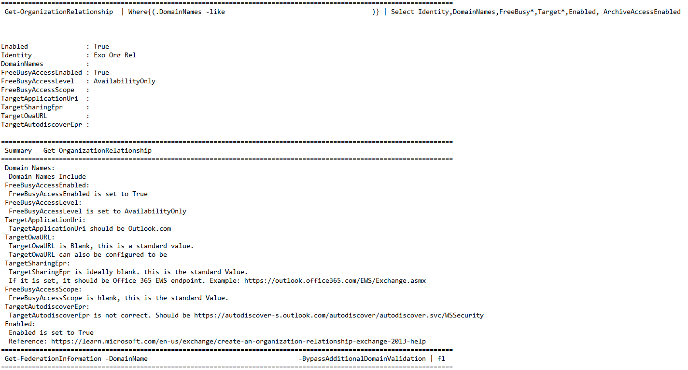
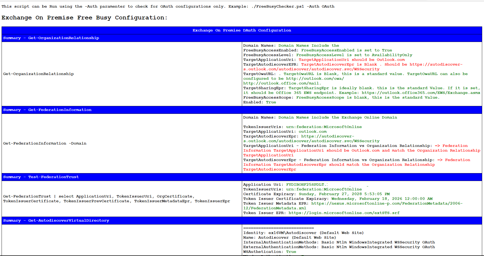

# Hybrid-Free-Busy-Configuration-Checker

To View this Project at GitHub! [GitHub Repository](https://github.com/MarcoLFrancisco/Hybrid-Free-Busy-Configuration-Checker)

To Download the latest release: [FreeBusyChecker.ps1](https://github.com/MarcoLFrancisco/Hybrid-Free-Busy-Configuration-Checker/releases/download/Version1/FreeBusyChecker.ps1)

To Provide Feedback about this tool: [Feedback Form](https://forms.office.com/pages/responsepage.aspx?id=v4j5cvGGr0GRqy180BHbR2LVru-UswhJmHot_XEUrVVURFVMRkE5VUg4QUU0MEpNRjgxUExPVlBVOS4u)

- This script does not make changes to current settings. It collects relevant configuration information regarding Hybrid Free Busy configurations on Exchange On Premises Servers and on Exchange Online, both for OAuth and DAuth.

- This is a Beta Version. Please double check on any information provided by this script before proceeding to address any changes to your Environment. Be advised that there may be incorrect content in the provided output.

Use: Collects OAuth and DAuth Hybrid Availability Configuration Settings Both for Exchange On Premises and Exchange Online

Example Screen Output:

Example TXT Output:

Example HTML Output

Supported Exchange Server Versions:

The script can be used to validate the Availability configuration of the following Exchange Server Versions: - Exchange Server 2013 - Exchange Server 2016 - Exchange Server 2019 - Exchange Online

Required Permissions:

- Organization Management
- Domain Admins

Please make sure that the account used is a member of the Local Administrator group. This should be fulfilled on Exchange servers by being a member of the Organization Management group. However, if the group membership was adjusted or in case the script is executed on a non-Exchange system like a management server, you need to add your account to the Local Administrator group.

Other Pre Requisites:

AD management Tools:

If not available, they can be installed with the following command:

  Install-WindowsFeature -name AD-Domain-Services -IncludeManagementTools

Imports and Installs the following Modules (if not available):

PSSnapin: microsoft.exchange.management.powershell.snapin
Module  : ActiveDirectory Module
Module  : ExchangeOnlineManagement Module

Syntax:

    FreeBusyChecker.ps1
        [-Auth <string>]
        [-Org <string>]
        [-OnPremUser <string>]
        [-OnlineUser <string>]
        [-OnPremDomain <string>]
        [-OnPremEWSUrl <string>]
        [-OnPremLocalDomain <string>]
        [-Help <string>]

How To Run:

- This script must be run as Administrator in Exchange Management Shell on an Exchange Server. You can provide no parameters and the script will just run against Exchange On Premises and Exchange Online to query for OAuth and DAuth configuration setting. It will compare existing values with standard values and provide detail of what may not be correct.

- Please take note that though this script may output that a specific setting is not a standard setting, it does not mean that your configurations are incorrect. For example, DNS may be configured with specific mappings that this script can not evaluate.

Valid Input Option Parameters:

  Parameter               : Auth
    Options               : All; DAuth; OAUth; Null

        All               : Collects information both for OAuth and DAuth;
        DAuth             : DAuth Authentication
        OAuth             : OAuth Authentication
        Default Value.    : Null. No switch input means the script will collect information for the current used method. If OAuth is enabled only OAuth is checked.

  Parameter               : Org
    Options               : ExchangeOnPremise; ExchangeOnline; Null

        ExchangeOnPremise : Use ExchangeOnPremise parameter to collect Availability information in the Exchange On Premise Tenant
        ExchangeOnline    : Use ExchangeOnline parameter to collect Availability information in the Exchange Online Tenant
        Default Value.    : Null. No switch input means the script will collect both Exchange On Premise and Exchange OnlineAvailability configuration Detail

  Parameter               : Help
    Options               : Null; True; False

        True              : Use the $True parameter to use display valid parameter Options.

  Parameter               : OnPremUser
    Options               : Exchange On premise Email Address

        OnPremUser        : Use OnPremUser parameter to run script using a specific Exchange on premises mailbox

  Parameter               : OnlineUser
    Options               : Exchange Online Hybrid Email Address

        OnlineUser        : Use OnlineUser parameter to run script using a specific Exchange Online Hybrid mailbox

  Parameter               : OnPremEWSUrl
    Options               : Exchange On Premises EWS url

        OnPremEWSUrl      : Use OnPremEWSUrl parameter to run script specifying the Exchange On Premises EWS url

  Parameter               : OnPremLocalDomain
    Options               : Exchange On Premises EWS url

        OnPremLocalDomain : Use OnPremLocalDomain parameter to run script specifying the Exchange On Premises local Domain

Examples:

- This cmdlet will run Free Busy Checker script and check Availability for Exchange On Premises and Exchange Online for the currently used method, OAuth or DAuth. If OAuth is enabled OAUth is checked. If OAUth is not enabled, DAuth Configurations are collected.

            PS C:\> .\FreeBusyChecker.ps1

- This cmdlet will run Free Busy Checker script and check Availability OAuth and DAuth Configurations both for Exchange On Premises and Exchange Online.

            PS C:\> .\FreeBusyChecker.ps1 -Auth All

- This cmdlet will run the Free Busy Checker Script against for OAuth Availability Configurations only.

            PS C:\> .\FreeBusyChecker.ps1 -Auth OAuth

- This cmdlet will run the Free Busy Checker Script against for DAuth Availability Configurations only.

            PS C:\> .\FreeBusyChecker.ps1 -Auth DAuth

- This cmdlet will run the Free Busy Checker Script for Exchange Online Availability Configurations only.

            PS C:\> .\FreeBusyChecker.ps1 -Org ExchangeOnline

- This cmdlet will run the Free Busy Checker Script for Exchange On Premises OAuth and DAuth Availability Configurations only.

            PS C:\> .\FreeBusyChecker.ps1 -Org ExchangeOnPremise

- This cmdlet will run the Free Busy Checker Script for Exchange On Premises Availability OAuth Configurations using a specific On Premises mailbox

            PS C:\> .\FreeBusyChecker.ps1 -Org ExchangeOnPremise -Auth OAuth -OnPremUser John.OnPrem@Contoso.com
