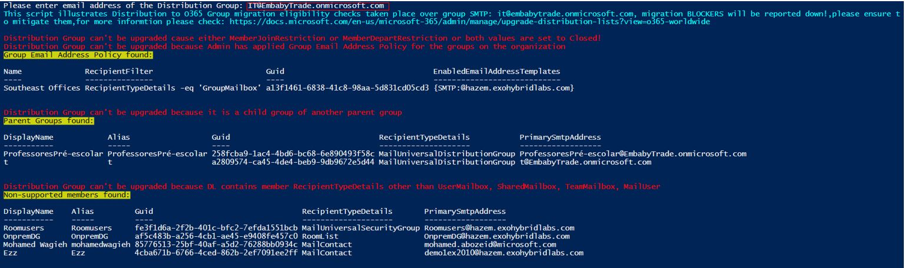
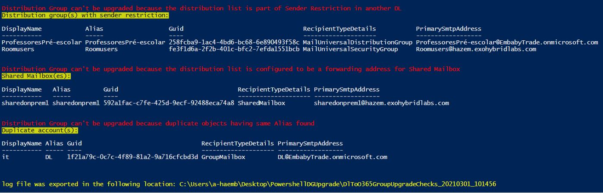
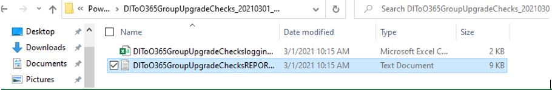
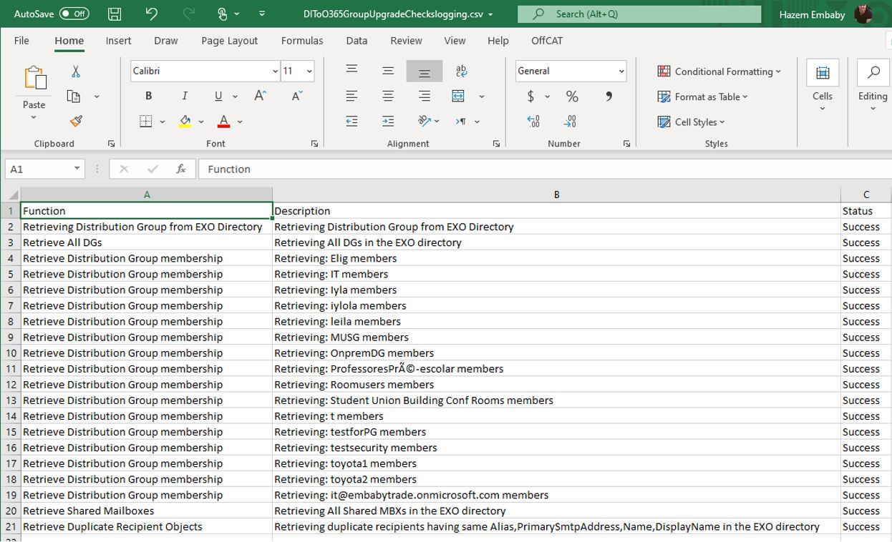

# DLT365GroupsUpgrade

Download the latest release: [DLT365GroupsUpgrade.ps1](https://github.com/microsoft/CSS-Exchange/releases/latest/download/DLT365GroupsUpgrade.ps1)

## Validating Distribution group eligibility for upgrade to O365 Group

This script allows you to check Distribution to O365 Group migration eligibility for a specific distribution group SMTP, for more information over the Distribution to O365 Group migration blockers please check: https://docs.microsoft.com/en-us/microsoft-365/admin/manage/upgrade-distribution-lists?view=o365-worldwide

The script will prompt for global administrator username & password to connect to EXO
Then the script will ask for required group smtp
Then start to check and provide feedback in case group migration blockers found as illustrated below:

## Exchange Online endpoints

The optional `-ConnectionUri` and `-AzureADAuthorizationEndpointUri` parameters override the Exchange Online connection and authorization endpoints when the script opens a session. If omitted, the Exchange Online module's defaults are unchanged.

Set the variables below to the endpoints documented for your cloud:

```powershell
.\DLT365GroupsUpgrade.ps1 -ConnectionUri $connectionUri `
    -AzureADAuthorizationEndpointUri $authorizationEndpointUri
```

Both overrides are used whether the Exchange Online module is already loaded or needs to be installed. An existing open Exchange Online session is still reused; these parameters do not reconnect or change that session.

See [Connect-ExchangeOnline](https://learn.microsoft.com/powershell/module/exchangepowershell/connect-exchangeonline) for endpoint guidance. Endpoint selection does not change feature availability or the module installation requirement.

## Example output








