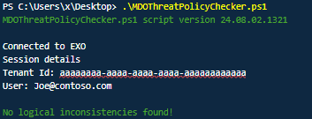
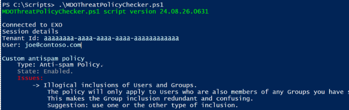
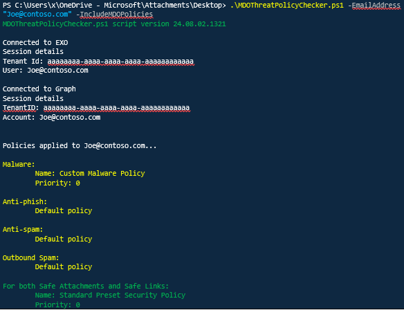
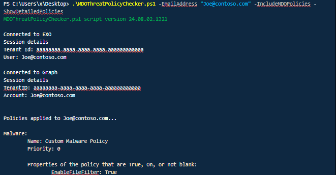
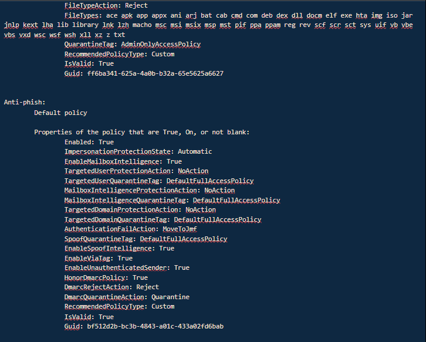
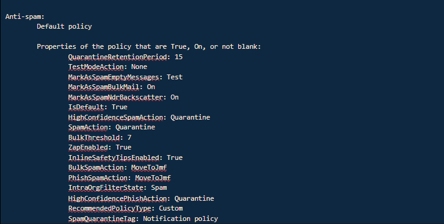
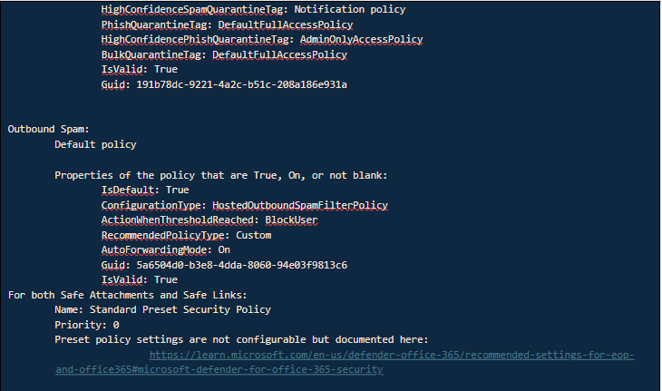

# MDOThreatPolicyChecker

Download the latest release: [MDOThreatPolicyChecker.ps1](https://github.com/microsoft/CSS-Exchange/releases/latest/download/MDOThreatPolicyChecker.ps1)

Use this script to find inconsistencies or redundancies in user membership and policy application of Microsoft Defender for Office 365 and Exchange Online Protection threat policies that lead to missed or unexpected coverage of users by the policy. If issues are found, the script provides guidance on how to resolve them.

The script also helps you identify which threat policies cover a particular user, including anti-malware, anti-phishing, inbound and outbound anti-spam, as well as Safe Attachments and Safe Links policies in case these are licensed for your tenant.

The script can help with such questions as:

- Are there confusing policies with conditions that lead to unexpected coverage or coverage gaps?

- Which threat policies apply to a recipient, **or should have applied** but did not? **No actual detection or Network Message ID needed.**

- Which actions would be taken on an email for each policy matched?

The script runs only in Read mode from Exchange Online and Microsoft Graph PowerShell. It does not modify any policies, and only provides actionable guidance for administrators for remediation.

## Prerequisites
The script uses Powershell cmdlets from the Exchange Online module and from the Microsoft.Graph.Authentication, Microsoft.Graph.Groups, and Microsoft.Graph.Users modules.

To run the Graph cmdlets used in this script, you only need the following modules from the Microsoft.Graph PowerShell SDK:

- Microsoft.Graph.Groups: for managing groups, including `Get-MgGroup` and `Get-MgGroupMember`.

- Microsoft.Graph.Users: for managing users, such as `Get-MgUser`.

- Microsoft.Graph.Authentication: for authentication purposes and to run any cmdlet that interacts with Microsoft Graph.

You can find the Microsoft Graph modules in the following link:<br>
&nbsp;&nbsp;&nbsp;&nbsp;https://www.powershellgallery.com/packages/Microsoft.Graph/<br>

&nbsp;&nbsp;&nbsp;&nbsp;https://learn.microsoft.com/en-us/powershell/microsoftgraph/installation?view=graph-powershell-1.0#installation


Here's how you can install the required submodules for the PowerShell Graph SDK cmdlets:

```powershell
Install-Module -Name Microsoft.Graph.Authentication -Scope CurrentUser
Install-Module -Name Microsoft.Graph.Groups -Scope CurrentUser
Install-Module -Name Microsoft.Graph.Users -Scope CurrentUser
```

!!! warning "NOTE"

    Remember to run these commands in a PowerShell session with the appropriate permissions. The -Scope CurrentUser parameter installs the modules for the current user only, which doesn't require administrative privileges.


In the Graph connection, you will need the following scopes 'Group.Read.All','User.Read.All'<br>
```powershell
Connect-MgGraph -Scopes 'Group.Read.All','User.Read.All'
```
<br><br>
You also need an Exchange Online session.<br>
```powershell
Connect-ExchangeOnline
```

You can find the Exchange module and information in the following links:<br>
&nbsp;&nbsp;&nbsp;&nbsp;https://learn.microsoft.com/en-us/powershell/exchange/exchange-online-powershell-v2?view=exchange-ps<br>
&nbsp;&nbsp;&nbsp;&nbsp;https://www.powershellgallery.com/packages/ExchangeOnlineManagement


## Parameters and Use Cases:
Run the script without any parameters to review all threat protection policies and to find inconsistencies with user inclusion and/or exclusion conditions:



**Script Output 1: No logical inconsistencies found** message if the policies are configured correctly, and no further corrections are required.



**Script Output 2: Logical inconsistencies found**. Inconsistencies found in the antispam policy named 'Custom antispam policy', and consequent recommendations shown -- illogical inclusions as both users and groups are specified. This policy will only apply to the users who are also members of the specified group.

- IncludeMDOPolicies

Add the parameter -IncludeMDOPolicies to view Microsoft Defender for Office 365 Safe Links and Safe Attachments policies:



**Script Output 3: Parameters -EmailAddress and -IncludeMDOPolicies** specified to validate Microsoft Defender for Office 365 Safe Attachments and Safe Links policies, on top of Exchange Online Protection policies.

- ShowDetailedPolicies

To see policy details, run the script with the -ShowDetailedPolicies parameter:









**Script Output 4: Policy actions**. Use -ShowDetailedPolicies to see the details and actions for each policy.

## Additional examples

To provide multiple email addresses by command line and see only EOP policies, run the following:<br>
```powershell
.\MDOThreatPolicyChecker.ps1 -EmailAddress user1@contoso.com,user2@fabrikam.com
```

To provide a CSV input file with email addresses and see both EOP and MDO policies, run the following:<br>
```powershell
.\MDOThreatPolicyChecker.ps1 -CsvFilePath [Path\filename.csv] -IncludeMDOPolicies
```

To provide an email address and see only MDO (Safe Attachment and Safe Links) policies, run the following:<br>
```powershell
.\MDOThreatPolicyChecker.ps1 -EmailAddress user1@contoso.com -OnlyMDOPolicies
```

To get all mailboxes in your tenant and print out their EOP and MDO policies, run the following:<br>
```powershell
.\MDOThreatPolicyChecker.ps1 -IncludeMDOPolicies -EmailAddress @(Get-ExOMailbox -ResultSize unlimited | Select-Object -ExpandProperty PrimarySmtpAddress)
```

## Parameters

Parameter | Description |
----------|-------------|
CsvFilePath | Allows you to specify a CSV file with a list of email addresses to check. Csv file must include a first line with header Email.
EmailAddress | Allows you to specify email address or multiple addresses separated by commas.
IncludeMDOPolicies | Checks both EOP and MDO (Safe Attachment and Safe Links) policies for user(s) specified in the CSV file or EmailAddress parameter.
OnlyMDOPolicies | Checks only MDO (Safe Attachment and Safe Links) policies for user(s) specified in the CSV file or EmailAddress parameter.
ShowDetailedPolicies | In addition to the policy applied, show any policy details that are set to True, On, or not blank.
SkipConnectionCheck | Skips connection check for Graph and Exchange Online.
SkipVersionCheck | Skips the version check of the script.
ScriptUpdateOnly | Just updates script version to latest one.
