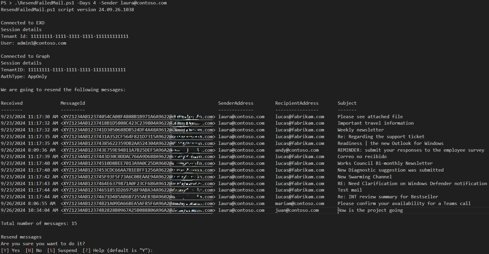
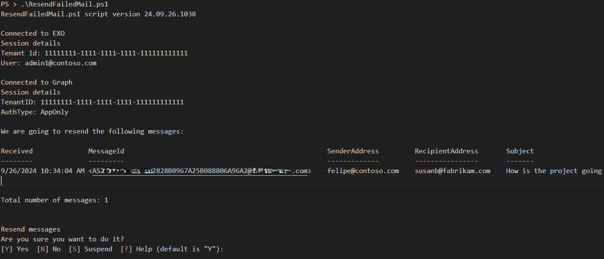

# ResendFailedMail

Download the latest release: [ResendFailedMail.ps1](https://github.com/microsoft/CSS-Exchange/releases/latest/download/ResendFailedMail.ps1)

Use this script to identify and resend failed emails from Exchange Online. It leverages the Microsoft Exchange Online and Graph Powershell modules to retrieve message IDs, message bodies, and attachments, and resend them using PowerShell. It provides filtering options like sender, recipient, subject, start and end dates, and message ID so you can target only the failed emails you want to resend.

The script can help in this type of scenario:

- Your entire tenant has been blocked due to exceeding sending threshold limits, and you have legitimate email that still needs to go out.

- A user has exceeded the sending limits for Exchange Online, for example, and becomes blocked from sending.

- After the problem is mitigated and the sender or tenant is unblocked, you need to resend some legitimate outbound or internal emails.

- Exchange Online will not do this automatically nor has any tools to do it that do not require scripting. This script will help you do that easily.

!!! note
    The script can only be used to send email that is currently in a mailbox to the originally intended recipients, and it cannot be used to redirect email to a different recipient.

## Prerequisites
Before running this script, ensure you meet the following prerequisites:

1. The Exchange Online Powershell module must be installed to retrieve the failed message IDs.

2. The `Microsoft.Graph.Authentication`, `Microsoft.Graph.Mail`, and `Microsoft.Graph.Users.Actions` modules must be installed to read and send emails.

    - Here's how you can install the required modules/submodules:

```powershell
Install-Module -Name ExchangeOnlineManagement
Install-Module -Name Microsoft.Graph.Authentication
Install-Module -Name Microsoft.Graph.Users.Actions
Install-Module -Name Microsoft.Graph.Mail
```

3. An App must be registered in Azure Active Directory to interact with the Microsoft Graph API specifically to run this script.

    - You can register a Microsoft Azure app in your tenant here: <br>https://portal.azure.com/#view/Microsoft_AAD_RegisteredApps/ApplicationsListBlade
      - Click **New registration**.
      - Provide a name and account type.
      - **Redirect URI** can be left blank.

    - Assign permissions:
      - Under **Manage | API permissions** for the app, click **Add a permission**.
      - Select **Microsoft Graph**.
      - Select the **Application permission** type.
      - Search for and select the following permissions:
         - **Mail.Read** (Application)
         - **Mail.Send** (Application)
      - Grant admin consent for your tenant for both the permissions.
      - When created, the API permissions should look like this:
        

    - Create a new client secret for the app under `Manage | Certificates & secrets`.

        !!! warning
            Save the Value field of the secret **immediately** after creating it; you can't retrieve it later.

        !!! tip
            Customize the duration of the secret to expire soon if you don't expect to use the app for an extended period.

    - Use the `client_id`, `tenant_id`, and `client_secret` obtained during app registration to authenticate with Microsoft Graph in the script (connection instructions below).
<br>
4. After completion of the above steps, and before running the script, connect to Exchange Online and Graph API with Powershell, as follows:

```powershell
Connect-ExchangeOnline -ShowBanner:$false

$ClientSecretCredential = Get-Credential -Credential "[YOUR APP ID HERE]"
# Enter client_secret in the password prompt.
Connect-MgGraph -TenantId "[YOUR TENANT ID HERE]" -ClientSecretCredential $ClientSecretCredential -NoWelcome
```

You can find the Microsoft Graph modules in the following link:
&nbsp;&nbsp;&nbsp;&nbsp;https://www.powershellgallery.com/packages/Microsoft.Graph/
&nbsp;&nbsp;&nbsp;&nbsp;https://learn.microsoft.com/en-us/powershell/microsoftgraph/installation?view=graph-powershell-1.0#installation

You can find the Exchange module and information in the following links:
&nbsp;&nbsp;&nbsp;&nbsp;https://learn.microsoft.com/en-us/powershell/exchange/exchange-online-powershell-v2?view=exchange-ps
&nbsp;&nbsp;&nbsp;&nbsp;https://www.powershellgallery.com/packages/ExchangeOnlineManagement

## Parameters and Use Cases:
Run the script with the Days parameter to specify the number of days in the past to retrieve email with a **Failed** status as well as with the Sender parameter. You will be prompted before executing this command.

!!! warning

    Make sure the original cause of the failed sending is fixed, or the script will also fail to send it.



**Script Output 1: Resending Last 4 Days of Failed Email from Specific Sender**

Run the script with no parameters to resend all Failed email from the past day.



**Script Output 2: Default Execution of Script with No Parameters**


## Additional examples

To resend email from specific sender, recipient, and number of days, run the following:
```powershell
.\ResendFailedMail.ps1 -Sender gary@contoso.com -Recipient ahmad@fabrikam.com -Days 7
```
<br>To resend email from a specific sender for the past 5 days without a confirmation prompt, run the following:
```powershell
.\ResendFailedMail.ps1 -Force -Sender gary@contsoso.com -Days 5
```
<br>To resend email between a specific start and end date, run the following:
```powershell
.\ResendFailedMail.ps1 -StartDate 12-Oct-2024 -EndDate 14-Oct-2024
```
<br>To resend an email based on the Message ID, and include any duplicates, run the following:
```powershell
.\ResendFailedMail.ps1 -MessageId "<1111XXX@MailServer.contoso.com>" -IncludeDuplicates
```

## Parameters - all parameters are optional

Parameter | Description |
----------|-------------|
SenderAddress | Filter emails based on the sender's address.
RecipientAddress | Filter emails based on the recipient's address.
Subject | Filter emails based on the email Subject.
MessageId | Filter emails based on the MessageId address. **You must put the MessageId in double quotes**
StartDate | Specify the start date of the inclusion period of emails to resend. The maximum is 10 days prior to the current date.
EndDate | Specify the end date of the inclusion period of emails to resend.
Days | Resend emails that failed within the past X number of days. Default is 1 day. The maximum is 10 days.
Force | Sends emails without confirmation prompt.
IncludeDuplicates | Will resend all emails with the same Message Id.
SkipConnectionCheck | Skips connection check for Graph and Exchange Online.
SkipVersionCheck | Skips the version check of the script.
ScriptUpdateOnly | Just updates script version to latest one.
