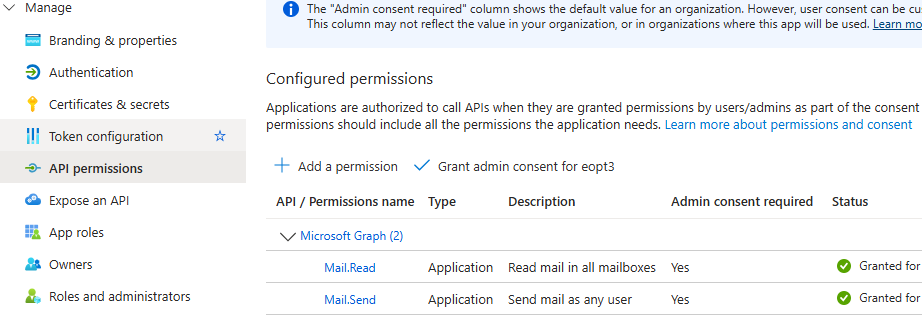
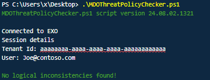
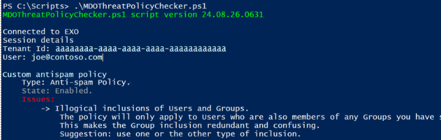
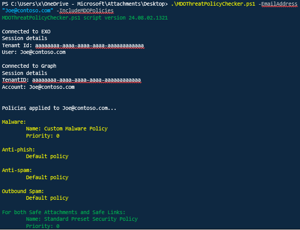
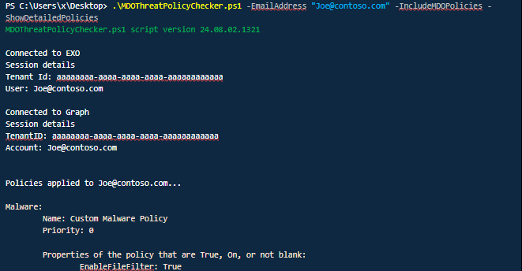
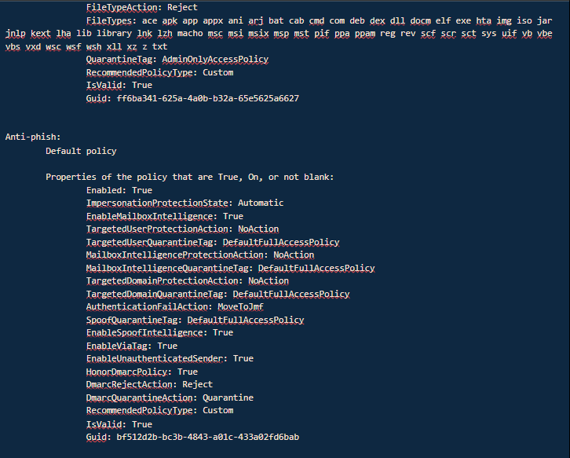
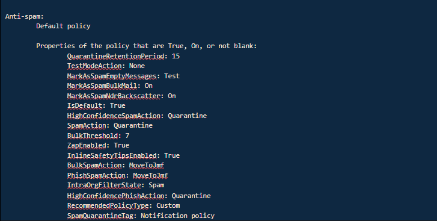
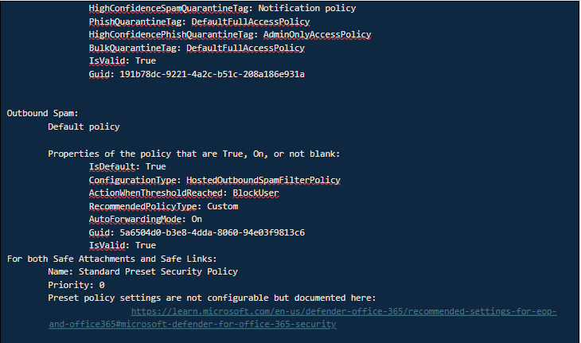

# ResendFailedOutboundMail

Download the latest release: [ResendFailedOutboundMail.ps1](https://github.com/microsoft/CSS-Exchange/releases/latest/download/ResendFailedOutboundMail.ps1)

Use this script to identify and resend failed emails from Exchange Online. It leverages the Microsoft Exchange Online and Graph Powershell modules to retrieve message IDs, message bodies, and attachments, and resend them using PowerShell. It provides filtering options like sender, recipient, subject, and message ID so you can target the failed emails you want to resend.

The script can help in this type of scenario:

- A user has exceeded the sending limits for Exchange Online, for example, or for sending excessive spam, and becomes blocked from sending.

- After the problem is mitigated and the sender unblocked, you need to resend some legitimate outbound or internal emails.

- Exchange Online will not do this automatically nor has any tools to do it that do not require scripting. This script will help you do that easily.

## Prerequisites
Before running this script, ensure you meet the following prerequisites:

1. The Exchange Online Powershell module is installed to retrieve the failed message IDs.

2. The `Microsoft.Graph.Authentication`, `Microsoft.Graph.Mail`, and `Microsoft.Graph.Users.Actions` modules are installed to read and send emails.

  - Here's how you can install the required modules/submodules:

```powershell
Install-Module -Name ExchangeOnlineManagement
Install-Module -Name Microsoft.Graph.Authentication
Install-Module -Name Microsoft.Graph.Users.Actions
Install-Module -Name Microsoft.Graph.Mail
```

3. An App is registered in Azure Active Directory to interact with the Microsoft Graph API specifically to run this script.

    - Register a Microsoft Azure app in your tenant here: <br>https://portal.azure.com/#view/Microsoft_AAD_RegisteredApps/ApplicationsListBlade
    - Within your newly created app registration, grant the following API permissions:
      - **Mail.Read** (Application)
      - **Mail.Send** (Application)
    - Also grant admin consent for your tenant for both the permissions.

    - When created, the API permissions should look like this:
    
    - Under `Manage | Certificates & secrets`, create a new client secret for the app.
      > [!IMPORTANT] Save the Value field of the secret **immediately** after creating it; you can't retrieve it later.

      > [!TIP] Customize the duration of the secret to expire soon if you don't expect to use the app for an extended period.
    - Use the `client_id`, `tenant_id`, and `client_secret` obtained during app registration to authenticate with Microsoft Graph in the script (connection instructions below).

4. After completion of the above steps, you must be connected to Exchange Online and Graph API with Powershell, as follows:

```powershell
Connect-ExchangeOnline -ShowBanner:$false

Connect-MgGraph -TenantId "[YOUR TENANT ID HERE]" -ClientSecretCredential (New-Object -TypeName System.Management.Automation.PSCredential -ArgumentList "[YOUR APP ID HERE]", (ConvertTo-SecureString -String "[VALUE FIELD OF YOUR SECRET HERE]" -AsPlainText -Force)) -NoWelcome
```

You can find the Microsoft Graph modules in the following link:<br>
&nbsp;&nbsp;&nbsp;&nbsp;https://www.powershellgallery.com/packages/Microsoft.Graph/<br>

&nbsp;&nbsp;&nbsp;&nbsp;https://learn.microsoft.com/en-us/powershell/microsoftgraph/installation?view=graph-powershell-1.0#installation


You can find the Exchange module and information in the following links:<br>
&nbsp;&nbsp;&nbsp;&nbsp;https://learn.microsoft.com/en-us/powershell/exchange/exchange-online-powershell-v2?view=exchange-ps<br>
&nbsp;&nbsp;&nbsp;&nbsp;https://www.powershellgallery.com/packages/ExchangeOnlineManagement


## Parameters and Use Cases:
Run the script without any parameters to review all threat protection policies and to find inconsistencies with user inclusion and/or exclusion conditions:



**Script Output 1: No logical inconsistencies found** message if the policies are configured correctly, and no further corrections are required.



**Script Output 2: Logical inconsistencies found**. Inconsistencies found in the antispam policy named 'Custom antispam policy', and consequent recommendations shown -- illogical inclusions as both users and groups are specified. This policy will only apply to the users who are also members of the specified group.

- IncludeMDOPolicies

Add the parameter -IncludeMDOPolicies to view Microsoft Defender for Office 365 Safe Links and Safe Attachments policies:



**Script Output 3: Parameters -EmailAddress and -IncludeMDOPoliciesEOP** specified to validate Microsoft Defender for Office 365 Safe Attachments and Safe Links policies, on top of Exchange Online Protection policies.

- ShowDetailedPolicies

To see policy details, run the script with the -ShowDetailedPolicies parameter:









**Script Output 4: Policy actions**. Use -ShowDetailedPolicies to see the details and actions for each policy.

## Additional examples

To provide multiple email addresses by command line and see only EOP policies, run the following:<br>
```powershell
.\MDOThreatPolicyChecker.ps1 -EmailAddress user1@contoso.com,user2@fabrikam.com
```

To provide a CSV input file with email addresses and see both EOP and MDO policies, run the following:<br>
```powershell
.\MDOThreatPolicyChecker.ps1 -CsvFilePath [Path\filename.csv] -IncludeMDOPolicies
```

To provide an email address and see only MDO (Safe Attachment and Safe Links) policies, run the following:<br>
```powershell
.\MDOThreatPolicyChecker.ps1 -EmailAddress user1@contoso.com -OnlyMDOPolicies
```

To get all mailboxes in your tenant and print out their EOP and MDO policies, run the following:<br>
```powershell
.\MDOThreatPolicyChecker.ps1 -IncludeMDOPolicies -EmailAddress @(Get-ExOMailbox -ResultSize unlimited | Select-Object -ExpandProperty PrimarySmtpAddress)
```

## Parameters

Parameter | Description |
----------|-------------|
CsvFilePath | Allows you to specify a CSV file with a list of email addresses to check. Csv file must include a first line with header Email.
EmailAddress | Allows you to specify email address or multiple addresses separated by commas.
IncludeMDOPolicies | Checks both EOP and MDO (Safe Attachment and Safe Links) policies for user(s) specified in the CSV file or EmailAddress parameter.
OnlyMDOPolicies | Checks only MDO (Safe Attachment and Safe Links) policies for user(s) specified in the CSV file or EmailAddress parameter.
ShowDetailedPolicies | In addition to the policy applied, show any policy details that are set to True, On, or not blank.
SkipConnectionCheck | Skips connection check for Graph and Exchange Online.
SkipVersionCheck | Skips the version check of the script.
ScriptUpdateOnly | Just updates script version to latest one.
