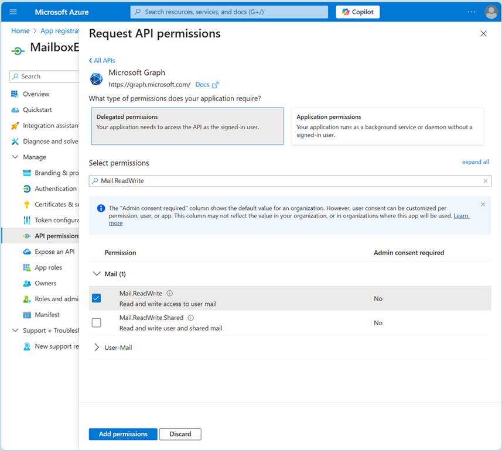

# Search-MailboxExtendedProperty

Download the latest release: [Search-MailboxExtendedProperty.ps1](https://github.com/microsoft/CSS-Exchange/releases/latest/download/Search-MailboxExtendedProperty.ps1)

## Description

This script searches the mailbox for any of the supplied mailbox named properties.

Initially get a list of named properties that you are interested in by running the `Get-MailboxExtendedProperty` cmdlet and filtering the results to a specific pattern e.g. on property name.

Then run the script supplying the set of filtered named properties.

The script will return a set of messages found with any of the supplied named properties.

The information about each message includes:
1. The Id of the message
2. The named property
3. The message subject
4. The message internet message id
5. The Id of the folder containing the message
6. The folder path expressed in \Inbox\Subfolder syntax

This message information is sufficient to attempt to remove the named property from the message using the `Remove-MailboxExtendedProperty.ps1` script.

There are some limitations: the search is limited to messages (extended properties can exist on folder, contact, calendar instances etc), single value extended properties (not multi-value), and the property value must be a non-null string.

### Syntax:

Example to search the mailbox for messages with any named properties matching the specific pattern.
```PowerShell
    $mailboxExtendedProperty = Get-MailboxExtendedProperty -Identity fred@contoso.com | Where-Object { $_.PropertyName -like '*Some Pattern*' }
    $messagesWithExtendedProperty = .\Search-MailboxExtendedProperty.ps1 -MailboxExtendedProperty $mailboxExtendedProperty
```

## Prerequisites

This script uses the [ExchangeOnlineManagement PowerShell module](#install-exchangeonlinemanagement-powershell-module) and an Exchange Online connection to be successfully established by a Tenant Admin.

```PowerShell
    Connect-ExchangeOnline -UserPrincipalName admin@contoso.com
```

This script uses [Microsoft Graph PowerShell modules](#install-microsoft-graph-powershell-modules) and requires a connection to already be established. Use of Microsoft Graph requires an [Azure App registration](#azure-app-registration).

To connect to Graph, using delegated access, and you know the credentials of the mailbox you want to search.

```PowerShell
    Connect-MgGraph -TenantId 2bbb42ba-e564-4f7b-9765-e19bc80c6123 -ClientId 8af900d8-db73-4918-81ef-3d35a873b6b2 -Scopes "User.Read Mail.ReadWrite"
```

    TenantId is that of the tenant.
    ClientId was provided during App registration.
    Scopes are the ones specified during App registration.

To connect to Graph, using delegated access, and you don't know the credentials of the mailbox you want to search. This generates a Url and device code, which is given to the end user and the end user performs the login on your behalf.

```PowerShell
    Connect-MgGraph -TenantId 2bbb42ba-e564-4f7b-9765-e19bc80c6123 -ClientId 8af900d8-db73-4918-81ef-3d35a873b6b2 -Scopes "User.Read Mail.ReadWrite" -UseDeviceCode
```

### Install ExchangeOnlineManagement PowerShell module

``` PowerShell
    Install-Module ExchangeOnlineManagement -RequiredVersion 3.4.0
```

### Install Microsoft Graph PowerShell modules

``` PowerShell
    Install-Module Microsoft.Graph.Users -RequiredVersion 2.24.0
    Install-Module Microsoft.Graph.Mail -RequiredVersion 2.24.0
```

### Azure App registration

For an overview of permissions and consent in the Microsoft identity platform see: https://learn.microsoft.com/entra/identity-platform/permissions-consent-overview.

An example of Azure App registration to allow use of this script, using delegated access, is as follows:

1. In the Azure Portal browse to the App registrations (https://portal.azure.com/#view/Microsoft_AAD_RegisteredApps/ApplicationsListBlade).


2. Enter the Name and Redirect Uri and Register.


3. The App has been registered, note the Directory ID (TenantId) and Application ID (ClientId) as they are required when connecting to Microsoft Graph.


4. Select the API Permissions and add a permission in addition to User.Read.


5. Add the Microsoft Graph delegated permission Mail.ReadWrite.





6. When connecting to Microsoft Graph for the first time you'll be asked to consent to the App having the access permissions granted in the previous steps.


