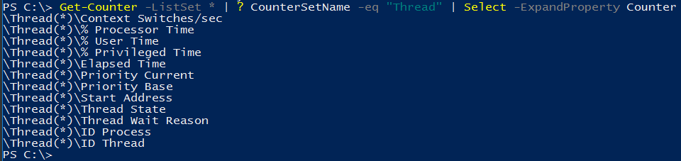
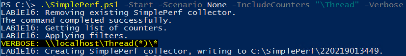
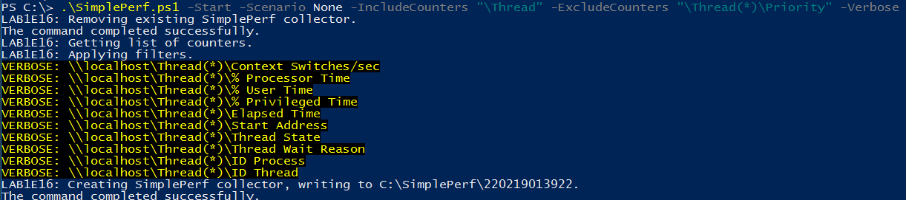
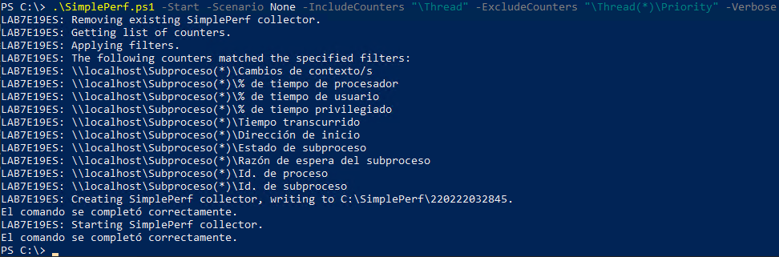

# SimplePerf

Download the latest release: [SimplePerf.ps1](https://github.com/microsoft/CSS-Exchange/releases/latest/download/SimplePerf.ps1)

This script is a stripped-down and streamlined performance log collector for Exchange Server.

## Common Examples

```powershell
.\SimplePerf.ps1 -Start
```
Starts a collector using Exchange counter defaults. The collector is non-circular, will run for 8 hours, has a
5-second interval, has a max file size of 1 GB, and saves the logs to C:\SimplePerf.

```powershell
.\SimplePerf.ps1 -Start -IncludeCounters "\Thread"
```
Starts a collector using Exchange counter defaults plus all \Thread counters. The collector is non-circular,
will run for 8 hours, has a 5-second interval, has a max file size of 1 GB, and saves the logs to C:\SimplePerf.

```powershell
.\SimplePerf.ps1 -Start -Duration 02:00:00 -Interval 30 -MaximumSizeInMB 512 -OutputFolder C:\PerfLogs
```
Starts a collector using Exchange counter defaults. The collector is non-circular, will run for 2 hours, has a
30-second interval, has a max file size of 512 MB, and saves the logs to C:\PerfLogs.

```powershell
.\SimplePerf.ps1 -Start -Duration 02:00:00 -Interval 30 -MaximumSizeInMB 1024 -Circular -OutputFolder C:\PerfLogs
```
Starts a collector using Exchange counter defaults. The collector is circular, will run for 2 hours, has a
30-second interval, has a max file size of 1024 MB, and saves the logs to C:\PerfLogs.

```powershell
.\SimplePerf.ps1 -Stop
```
Stops a running SimplePerf.

```powershell
Get-ExchangeServer | .\SimplePerf.ps1 -Start
```
Starts a SimplePerf with the default options on all Exchange servers.

```powershell
"SRV1", "SRV2", "SRV3" | .\SimplePerf.ps1 -Start
```
Starts a SimplePerf with the default options on the three named servers.

```powershell
"SRV1", "SRV2", "SRV3" | .\SimplePerf.ps1 -Stop
```
Stops a running SimplePerf on the three named servers.

## Using Named Collectors

It is possible to run several SimplePerf collectors on the same computer at the same time by providing the **-CollectorName** parameter. For example:

```powershell
.\SimplePerf -Start -Interval 60 -CollectorName "Minute"
.\SimplePerf -Start -Interval 5 -CollectorName "FiveSeconds"
```

When using collector names, the same name must be provided to the **-Stop** command:

```powershell
.\SimplePerf -Stop -CollectorName "Minute"
.\SimplePerf -Stop -CollectorName "FiveSeconds"
```

## Counter Name Filters

The counters collected by SimplePerf can be controlled with a combination of three parameters: **-Scenario**, **-IncludeCounters**, and **-ExcludeCounters**.

Currently, there are only two scenarios: **Exchange** and **None**. The **Exchange** scenario is a common set of counters for Exchange Server, similar to what ExPerfWiz would collect. **None** is a completely empty counter set.

**-IncludeCounters** and **-ExcludeCounters** perform a *StartsWith* match against the counter name. This makes it possible to collect a large number of counters with minimal syntax. For example:

```powershell
.\SimplePerf.ps1 -Start -IncludeCounters "\MSExchange", "\Microsoft Exchange"
```
This example starts a SimplePerf using the **Exchange** scenario, but then it includes *every* counter starting with either MSExchange or Microsoft Exchange.

```powershell
.\SimplePerf.ps1 -Start -IncludeCounters "\MSExchange", "\Microsoft Exchange" -Scenario "None"
```
This example starts a SimplePerf collecting all the matching Exchange counters *without* including any default counters at all, because the **None** scenario was specified.

```powershell
.\SimplePerf.ps1 -Start -ExcludeCounters "\MSExchange Transport"
```
In this example, we use the **Exchange** scenario as a starting point, but then we remove all counters starting with MSExchange Transport.

Note that individual counters can be excluded even if the counter set has been included. To illustrate:


In this screenshot we see all the counters that exist for the Thread set.


If we tell SimplePerf to include "\Thread", then it simply collects the whole object.


However, if we tell it to Include "\Thread" but exclude "\Thread(*)\Priority", we see that it has correctly expanded the Thread object and is collecting all counters except "Priority Current" and "Priority Base".

This filtering mechanism makes it easy to customize the counter set with minimal text. To check the result of your counter filters, add the **-Verbose** switch, or check the counters txt file in $env:TEMP.

Note that the resulting set can only show counters that exist on the local machine. For instance, you won't see any Exchange counters in the Verbose output if the script is not running on an Exchange Server.

## Language Support

SimplePerf works regardless of the current language. It does this by translating the provided counter filters to whatever the current server language happens to be. This means that counter names must always be provided in English, even when the current language is not English.

For example, here is the same command from the earlier example running on a server where Spanish is the current language:


