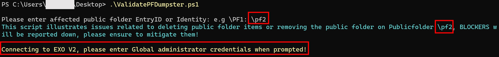
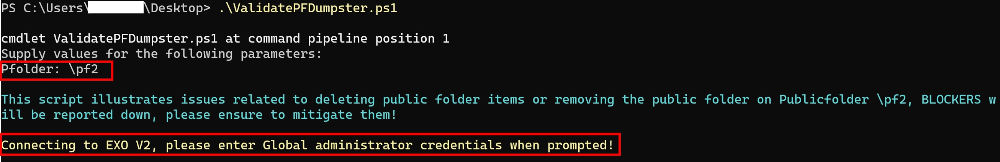
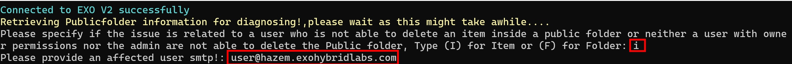
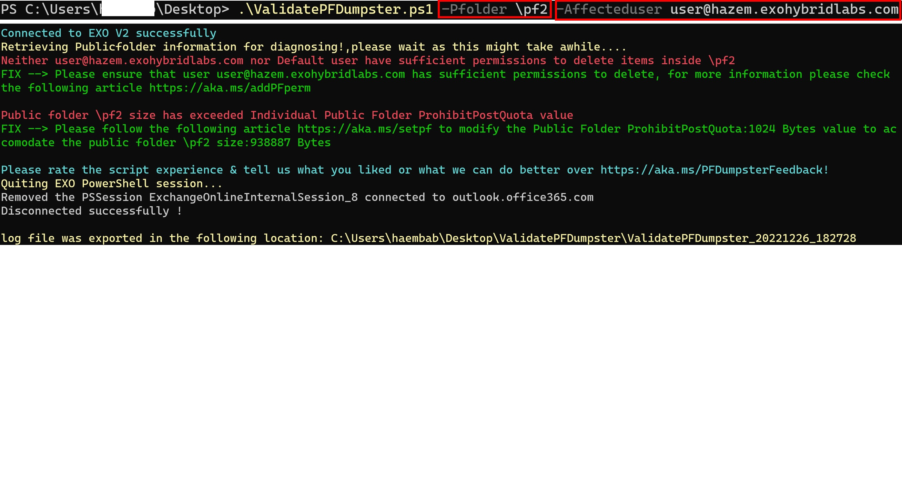
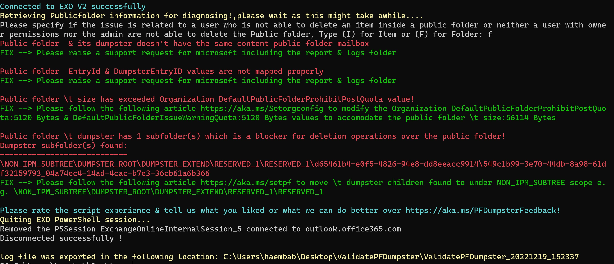
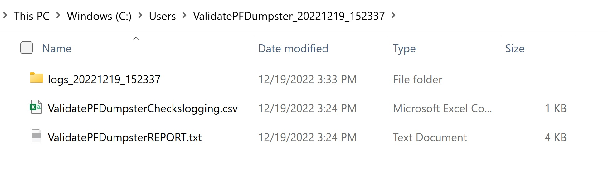
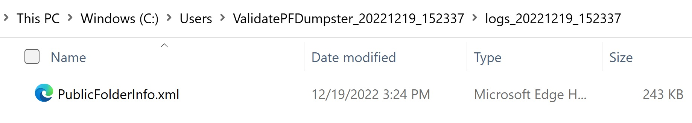

# ValidateExoPfDumpster

Download the latest release: [ValidateExoPfDumpster.ps1](https://github.com/microsoft/CSS-Exchange/releases/latest/download/ValidateExoPfDumpster.ps1)

This script investigates public folders/items deletion operations failures & propose FIXes for mitigation.
The script is working to validate the below conditions over the affected public folder

Checks run:
-----------
1.	Public folder size issue
    - Public folder content mailbox TotalDeletedItemSize value has exceeded its RecoverableItemsQuota value
    - Public folder size is full
2.	User permissions are not synced between public folder mailboxes
3.	Content Public folder mailbox across the public folder & its dumpster is different
4.	EntryId & DumpsterEntryID values are not mapped properly on the public folder & its dumpster
5.	Parent public folder dumpster is unhealthy
6.	Dumpster folder
7.	Dumpster folder has children
8.  Mail-enabled public folder health if MEPfProxyGuid was null

## Syntax

```powershell
ValidateExoPfDumpster.ps1
  [-PFolder <string[]>]
  [-AffectedUser <string[]>]
  [-ExportPath <string[]>]
```

## Output

The script will generate the public folder validation checks failures & proposed Fixes results on screen and will generate same results on ValidatePFDumpsterREPORT.txt file as well.
There are other files generated for either script logging purposes or sometimes for logs to be shared with Microsoft personnel in case issues encountered requires microsoft support team intervention.

File Name|Content|Use
-|-|-
ValidatePFDumpsterREPORT.txt|Information about any blockers found|The script will display what it found, and in many cases it will provide a mitigation to fix the problem
ValidatePFDumpsterChecksLogging.csv|Information about the reason of script failure to run|The file will display errors encountered on running the script and at which stage
PublicFolderInfo.xml|All required information about the affected public folder|This log file to be shared with Microsoft personnel

## Usage

Typically, the script should run with PFolder identity parameter as illustrated below:

```powershell
.\ValidateExoPfDumpster.ps1 -PFolder \pf1
```

The script will prompt for affected public folder identity/EntryID if it wasn't provided using PFolder parameter then it will prompt for global administrator username & password to connect to EXO by default it validates if the issue is specific to the Public folder "e.g. all users are affected"




If the issue happens only with a specific user on that case an affected user smtp address is required to be provided



In this example output, the script calls out two blockers.

It points out the below blockers:
   - Neither user nor Default user have sufficient permissions to delete items inside the public folder
   - Public folder size has exceeded Individual Public Folder ProhibitPostQuota value



In this example output, the script calls out four blockers.

It points out the below issues:
   - Public folder & its dumpster doesn't have the same content public folder mailbox
   - Public folder EntryId & DumpsterEntryID values are not mapped properly
   - Public folder size has exceeded Organization DefaultPublicFolderProhibitPostQuota value
   - Public folder dumpster has 1 subfolder

The script created a log file containing all the required information "PublicFolderInfo.xml" to be shared with Microsoft personnel for the first two blockers & provided mitigation for the last two blockers and you can see same results under ValidatePFDumpsterREPORT.txt file.





