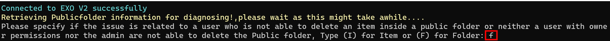

# ValidateEXOPFDumpster

Download the latest release: [ValidateEXOPFDumpster.ps1](https://github.com/microsoft/CSS-Exchange/releases/latest/download/ValidateEXOPFDumpster.ps1)

This script investigates public folders/items deletion operations failures & propose FIXes for mitigation.
The script is working to validate the below conditions over the affected public folder
Checks run:
-----------
1.	Public folder size issue
    a)	Public folder content mailbox TotalDeletedItemSize value has exceeded its RecoverableItemsQuota value
    b)	Public folder size is full
2.	User permissions are not synced between public folder mailboxes
3.	Content Public folder mailbox across the public folder & its dumpster is different
4.	EntryId & DumpsterEntryID values are not mapped properly on the public folder & its dumpster
5.	Parent public folder dumpster is unhealthy
6.	Dumpster folder
7.	Dumpster folder has children
8.  Mail-enabled public folder health if MEPFProxyGuid was null

## Syntax

```powershell
ValidateEXOPFDumpster.ps1
  [-ExportPath <string[]>]
```

## Output

The script will generate the public folder validation checks failures & proposed Fixes results on screen and will generate same results on ValidatePFDumpsterREPORT.txt file as well.
There are other files generated for either script logging purposes or sometimes for logs to be shared with Microsoft personnel in case issues encountered requires microsoft support team intervention.

File Name|Content|Use
-|-|-
ValidatePFDumpsterREPORT.txt|Information about any blockers found|The script will display what it found, and in many cases it will provide a mitigation to fix the problem
ValidatePFDumpsterCheckslogging.csv|Information about the reason of script failure to run|The file will display errors encountered on running the script and at which stage
PublicFolderInfo.xml|All required information about the affected public folder|This log file to be shared with Microsoft personnel

## Usage

Typically, the script should be run with no parameters:

```powershell
.\ValidateEXOPFDumpster.ps1
```

The script will ask for affected public folder identity/EntryID then it will prompt for global administrator username & password to connect to EXO


The script then prompts for either whether the issue was public folder related "Admin should enter letter f" or it happens only with a specific user "Admin should enter letter i" & on that case an affected user smtp address is required to be provided




In this example output, the script calls out two issues.

It points out the below issues:
    Neither user nor Default user have sufficient permissions to delete items inside the public folder
    Public folder size has exceeded Individual Public Folder ProhibitPostQuota value


In this example output, the script calls out four issues.

It points out the below issues:
    Public folder  & its dumpster doesn't have the same content public folder mailbox
    Public folder EntryId & DumpsterEntryID values are not mapped properly
    Public folder size has exceeded Organization DefaultPublicFolderProhibitPostQuota value
    Public folder dumpster has 1 subfolder

The script created a log file containing all the required information "PublicFolderInfo.xml" to be shared with Microsoft personnel for the first two blockers & provided mitigation for the last two blockers and you can see same results under ValidatePFDumpsterREPORT.txt file.


