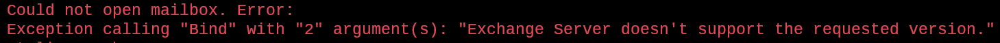
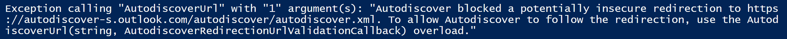
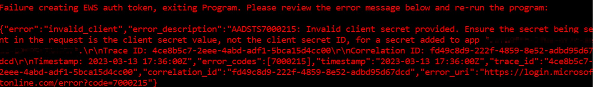
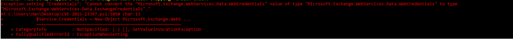
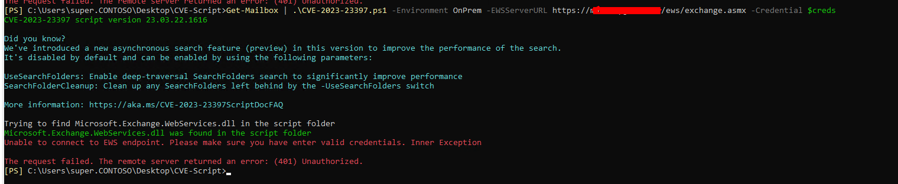
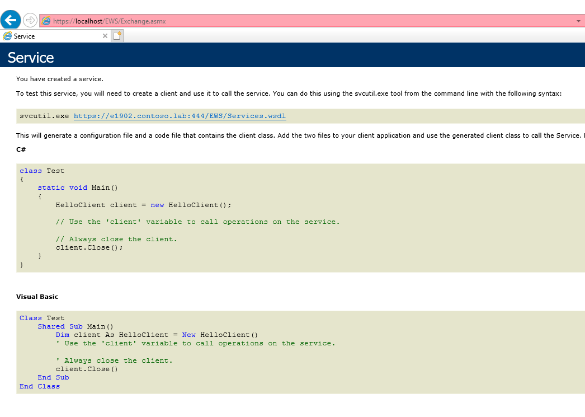

# CVE-2023-23397 script

Download the latest release: [CVE-2023-23397.ps1](https://github.com/microsoft/CSS-Exchange/releases/latest/download/CVE-2023-23397.ps1)

CVE-2023-23397.ps1 is a script that checks Exchange messaging items (mail, calendar and tasks) to see whether a property is populated with a non empty string value. It is up to the admin to determine if the value is malicious or not. If required, admins can use this script to clean up the property for items that are malicious or even delete the items permanently. Please see [CVE-2023-23397](https://msrc.microsoft.com/update-guide/vulnerability/CVE-2023-23397) for more information.

There are two modes for the script: Audit and Cleanup.

**Audit Mode:** Script provides a CSV file with details of items that have the property populated.

**Cleanup Mode:** Script performs cleanup on detected items by either clearing the property or deleting the item.

# Steps to run the script:

1. Fulfill the requirements according to environment (i.e. On-Premises or Online)
2. Run the script in audit mode.

    For organizations with large number of mailboxes:
    It is recommended to break up the mailbox list into multiple files, so the script can be run against mailboxes in batches. Here is an example of how to break up the mailboxes into batches of 1000:

    ````
    $batchSize = 1000; $batchNumber = 1; $count = 0; Get-Mailbox -ResultSize Unlimited | Select PrimarySmtpAddress | % {
      if ($count++ -ge $batchSize) { $batchNumber++; $count = 0; }
      Export-Csv -InputObject $_ -Path "Batch$batchNumber.csv" -Append
    }

    # Then run against the batches similar to this:
    Import-Csv .\BatchFileName.csv | .\CVE-2023-23397.ps1 -Environment Online
    ````

3. If the script execution finishes with "No vulnerable item found", no further action is required.
4. If step 2 generates CSV files, review the CSV file; if you find suspicious thing, then go to 5. If you only see blank things or paths to old .wav files, no need to go to step 5.
5. If you got suspected entries in CSV file, run the script in Cleanup mode

## Requirements

### Prerequisites to run the script for Exchange Server (on-premises)
To run this script in an on-premises Exchange Server environment, you need to use an account with the `ApplicationImpersonation` management role. You can create a new role group with the required permissions by running the following PowerShell command in an elevated Exchange Management Shell (EMS):

```powershell
New-RoleGroup -Name "CVE-2023-23397-Script" -Roles "ApplicationImpersonation" -Description "Permission to run the CVE-2023-23397 script"
Add-RoleGroupMember -Identity "CVE-2023-23397-Script" -Member "<UserWhoRunsTheScript>"
```
The script uses Exchange Web Services (EWS) to fetch items from user mailboxes. So, the machine on which the script is run should be able to make EWS calls to your Exchange server.

You can also create a new [Throttling Policy](https://learn.microsoft.com/exchange/client-developer/exchange-web-services/ews-throttling-in-exchange#throttling-policies-that-affect-ews) to prevent the user who runs the script from being throttled. Make sure to revert the throttling policy after you’re done running the script.

Please note that this is for Exchange on-premises environments only.

```powershell
New-ThrottlingPolicy "CVE-2023-23397-Script"
Set-ThrottlingPolicy "CVE-2023-23397-Script" -EWSMaxConcurrency Unlimited -EWSMaxSubscriptions Unlimited -CPAMaxConcurrency Unlimited -EwsCutoffBalance Unlimited -EwsMaxBurst Unlimited -EwsRechargeRate Unlimited
Set-Mailbox -Identity "<UserWhoRunsTheScript>" -ThrottlingPolicy "CVE-2023-23397-Script"
```

### Prerequisites to run the script for Exchange Online

To run this script in an Exchange Online environment, you need to be a `Global Administrator` or an `Application Administrator`. The script will create an application with full access permission on all the mailboxes.

Furthermore it is possible to use a certificate to run the script in `Audit` and `Cleanup` mode. This is called `Certificate Based Authentication (CBA)`. The steps are outlined in the [FAQ section](FAQ.md\#what-are-the-required-steps-to-prepare-the-cve-2023-23397application-application-to-support-certificate-based-authentication-cba).

**NOTE:** The script uses Microsoft.Exchange.WebServices.dll to make EWS calls. The script will try to download the DLL and use it. However, if it is unable to, you will need to download the DLL and specify the path.

#### Steps to Download Microsoft.Exchange.WebServices.dll:
-  Download the nuget package from [NuGet Gallery | Microsoft.Exchange.WebServices.2.2.0](https://api.nuget.org/v3-flatcontainer/microsoft.exchange.webservices/2.2.0/microsoft.exchange.webservices.2.2.0.nupkg)
-  Change the extension of the file from .nupkg to .zip
-  Unzip the package.
-  Use the dll present at “\lib\40” location in the package
-  Provide the path to the DLL for the `-DLLPath` parameter when running the script.

## How To Run

### Script Parameters

The script accepts the following parameters:

Parameter | Description
----------|------------
Environment | Specify the environment where you are running the script. This parameter is required.
CreateAzureApplication | Use this parameter to create an Azure AD application that can be used for running the script in Exchange Online.
DeleteAzureApplication | Use this parameter to delete the Azure AD application.
UserMailboxes | Use this parameter to provide a list of user primary SMTP addresses. You can pipe the addresses while running. This parameter is required in Audit mode.
StartTimeFilter | Use this parameter to provide start time filter. (Format: "mm/dd/yyyy hh:mm:ss")
EndTimeFilter | Use this parameter to provide end time filter. (Format: "mm/dd/yyyy hh:mm:ss")
CleanupAction | Use this parameter to provide type of cleanup action you want to perform (ClearProperty/ClearItem).
CleanupInfoFilePath | Use this parameter to provide path to the CSV file containing the details of messages to be cleaned up.
EWSExchange2013 | Use this switch if you are running on Exchange Server 2013 mailboxes.
DLLPath | Provide the path to Microsoft.Exchange.WebServices.dll. This is an optional parameter.
AzureApplicationName | Provide the name of the application which the script should create. This is an optional parameter. The default name is CVE-2023-23397Application.
CertificateThumbprint | Provide the thumbprint of the certificate which was uploaded to the Azure application. The certificate must exist under the 'Cert:\CurrentUser\My' path on the machine. It can only be used if the private key exists and is accessible.
AppId | Provide the ID of the application which was created in Azure and which is required to run the script in audit or cleanup mode. The ID can be found within the Azure application under 'Overview' and is labeled as: 'Application (client) ID'. If you don't specify this parameter but specify the `CertificateThumbprint` parameter, the script will ask you to logon to query the required information.
Organization | Provide the ID of your organization. It can be provided in GUID format or by using your onmicrosoft.com domain. If you don't specify this parameter but specify the `CertificateThumbprint` parameter, the script will ask you to logon to query the required information.
AzureEnvironment | Provide the Azure Environment name. This is an optional parameter. The default value is `Global`.
MaxCSVLength | Provide the maximum number of rows the script should create in the CSV while running in Audit mode. This is an optional parameter. The default is 200,000.
EWSServerURL | Provide the EWS endpoint. If not provided, the script will make an Autodiscover call to get it. This parameter works only with Exchange Server.
ScriptUpdateOnly | This optional parameter allows you to only update the script without performing any other actions.
SkipVersionCheck | This optional parameter allows you to skip the automatic version check and script update.
IgnoreCertificateMismatch | This optional parameter lets you ignore TLS certificate mismatch errors.
Credential | This optional parameter lets you pass admin credentials when running on Exchange Server.
UseSearchFolders | This parameter causes the script to use deep-traversal search folders, significantly improving performance.
SearchFolderCleanup | This parameter cleans up any search folders left behind by the asynchronous search feature. It must be used together with the `UseSearchFolders` parameter.
TimeoutSeconds | This optional parameter specifies the timeout on the EWS ExchangeService object. The default is 300 seconds (5 minutes).

#### Set Exchange Online Cloud Specific values:
You can use the `AzureEnvironment` parameter to specify the cloud against which the script runs. By default, the script will run against the Global (worldwide) service. Supported values are:

|AzureEnvironment|Cloud Environment|Name                           |
|----------------|-----------------|-------------------------------|
|Global          |AzureCloud       |WW                             |
|USGovernmentL4  |AzureUSGovernment|GCC                            |
|USGovernmentL5  |AzureUSGovernment|DOD                            |
|ChinaCloud      |AzureChinaCloud  |Office365 operated by 21Vianet |

### Running Against Exchange Server (On-Premises) Mailboxes

#### Audit Mode:

Execute the script in audit mode as an admin with the ApplicationImpersonation management role. For scanning on-premises mailboxes, the Environment value should be "Onprem" and you should provide the EWS URL of your Exchange server in EWSServerURL property. The script will ask for a login prompt, and the username must be provided.

!!! warning "Note"

    The username which is passed to the script, must be specified in the UPN format where the domain-part is a domain accepted by the Exchange Server.

Optionally, you can use the Credential flag to provide admin credentials in PSCredential format. Set the EWSServerURL parameter to specify the EWS URL if the Autodiscover call fails.

##### Examples:
This syntax runs the script to audit all the mailboxes.

```powershell
PS C:\> Get-Mailbox -ResultSize Unlimited | .\CVE-2023-23397.ps1 -Environment Onprem
```

Note: If there are Exchange 2013 servers in the environment with Exchange 2016 or 2019, the script may not be able to open mailboxes on Exchange 2013 and may give the following error:



If the above error appears, run the script with an additional parameter EWSExchange2013, as shown below.

```powershell
PS C:\> Get-Mailbox -ResultSize Unlimited | .\CVE-2023-23397.ps1 -Environment Onprem -EWSExchange2013
```


This syntax runs the script to audit all mailboxes for items that were created during a specific period.

```powershell
PS C:\> Get-Mailbox -ResultSize Unlimited | .\CVE-2023-23397.ps1 -Environment Onprem -StartTimeFilter "01/01/2023 00:00:00" -EndTimeFilter "01/01/2024 00:00:00"
```


#### Cleanup Mode:

The script provides a list of all the messages containing the problematic property in the mailboxes of users specified in an AuditResult_timestamp.CSV file. Admins should analyze this file and mark (with a "Y") messages for which either the property is to be cleaned or the message must be removed.

Step 1
Mark the messages for cleanup by entering “Y” instead of “N” in the cleanup column of CSV file.

Step 2
Choose either to remove the message or only the problematic property in the next step by specifying CleanupAction as “ClearItem” or “ClearProperty.” Execute the script as follows to remove the message or property marked with Y in the CSV file.

##### Examples:
This syntax runs the script to clear the problematic property from messages:

```powershell
PS C:\> .\CVE-2023-23397.ps1 -Environment Onprem -CleanupAction ClearProperty -CleanupInfoFilePath <Path to modified CSV>
```

This syntax runs the script to delete messages containing the malicious property

```powershell
PS C:\> .\CVE-2023-23397.ps1 -Environment Onprem -CleanupAction ClearItem -CleanupInfoFilePath <Path to modified CSV>
```

### Running Against Exchange Online Mailboxes

First, execute the script in Audit mode as an admin with `Global Administrator` or `Application Administrator` role. For scanning online mailboxes, the Environment parameter should be "Online."

While scanning Exchange Online mailboxes, the script needs an Azure AD app that has delegate permissions for all Exchange Online mailboxes. You can create the application using the script. And once the application is no longer required, you can delete the application using the script as well.

#### Managing AzureADApplication:
##### Examples:
This syntax runs the script to create an Azure application

```powershell
PS C:\> .\CVE-2023-23397.ps1 -CreateAzureApplication
```

This syntax runs the script to delete the Azure application created by the script

```powershell
PS C:\> .\CVE-2023-23397.ps1 -DeleteAzureApplication
```

#### Audit Mode:
##### Examples:
This syntax runs the script to Audit all mailboxes in Exchange Online.

**NOTE:** Connect to EXO with [Exchange Online PowerShell session](https://learn.microsoft.com/en-us/powershell/exchange/connect-to-exchange-online-powershell?view=exchange-ps)

```powershell
PS C:\> Get-EXOMailbox -ResultSize Unlimited | .\CVE-2023-23397.ps1 -Environment "Online"
```

This syntax runs the script to Audit all mailboxes for items that were during a specific period.

```powershell
PS C:\> Get-EXOMailbox -ResultSize Unlimited | .\CVE-2023-23397.ps1 -Environment "Online" -StartTimeFilter "01/01/2023 00:00:00" -EndTimeFilter "01/01/2024 00:00:00"
```

This syntax runs the script to Audit all mailboxes by using a certificate to authenticate and using the improved SearchFolder functionality.

```powershell
PS C:\> Get-EXOMailbox -ResultSize Unlimited | .\CVE-2023-23397.ps1 -Environment Online -CertificateThumbprint <Thumbprint of the certificate> -AppId <Application Id of the 'CVE-2023-23397Application' app> -Organization contoso.onmicrosoft.com -UseSearchFolders
```

#### Cleanup Mode:
##### Examples:
This syntax runs the script to clear the problematic property from messages.

```powershell
PS C:\> .\CVE-2023-23397.ps1 -Environment "Online" -CleanupAction ClearProperty -CleanupInfoFilePath <Path to modified CSV>
```

This syntax runs the script to delete messages containing the problematic property.

```powershell
PS C:\> .\CVE-2023-23397.ps1 -Environment "Online" -CleanupAction ClearItem -CleanupInfoFilePath <Path to modified CSV>
```

This syntax runs the script to delete messages containing the problematic property. It uses a certificate to acquire the required tokens.

```powershell
PS C:\> .\CVE-2023-23397.ps1 -Environment "Online" -CleanupAction ClearItem -CleanupInfoFilePath <Path to modified CSV> -CertificateThumbprint <Thumbprint of the certificate> -AppId <Application Id of the 'CVE-2023-23397Application' app> -Organization contoso.onmicrosoft.com
```

## Script execution errors and troubleshooting
### Exchange Server doesn’t support the requested version
If there are Exchange 2013 servers in an environment with Exchange 2016 or Exchange 2019, the script may not be able to open mailboxes on Exchange 2013 and may give the following error:


If the above error appears, run the script with the EWSExchange2013 parameter:

```powershell
PS C:\> Get-Mailbox -ResultSize Unlimited | .\CVE-2023-23397.ps1 -Environment Onprem -EWSExchange2013
```

### Blocked Autodiscover redirection



If Autodiscover fails due to a redirection error and the above error appears, provide the EWS URL using the EWSServerURL parameter.

### Invalid client secret provided



While running the script in Exchange Online, you might see the above error intermittently. Re-running the script should resolve the issue. If it occurs frequently, then remove the Azure application you have created using -DeleteAzureApplication parameter and then recreate it using -CreateAzureApplication parameter.

### "Cannot convert the "Microsoft.Exchange.WebServices.Data.WebCredentials"



Incorrect link was provided to download Microsoft.Exchange.WebServices.dll originally that is causing this issue. Follow these steps to correct this problem.


- Download the correct [NuGet Gallery | Microsoft.Exchange.WebServices.2.2.0](https://api.nuget.org/v3-flatcontainer/microsoft.exchange.webservices/2.2.0/microsoft.exchange.webservices.2.2.0.nupkg)
- Close PowerShell (**CRITICAL**)
- Launch new PowerShell session
- Run cmdlet again with providing new dll path ( should be `lib\40\Microsoft.Exchange.WebServices.dll`)

### Unable to connect to EWS endpoint - 401 unauthorized - On Prem.



You are getting a 401 unauthorized when trying to provide the `-EWSServerURL` parameter to the script. The possible causes can be due to bad credentials provided or the URL endpoint is not working correctly. Try to provide the credentials again to start off with. If that doesn't work, does the URL work when using a browser? You should get a result like this:



If you don't get a response looking like this after you are prompted for a username and password, then this could be the problem. Try to see if either the FQDN, `https://localhost/ews/exchange.asmx`, or `https://127.0.0.1/ews/exchange.asmx` works instead. If one of those do, use that instead for the `-EWSServerURL` parameter.

**NOTE:** Make sure to include `-IgnoreCertificateMismatch` if using localhost or 127.0.0.1
