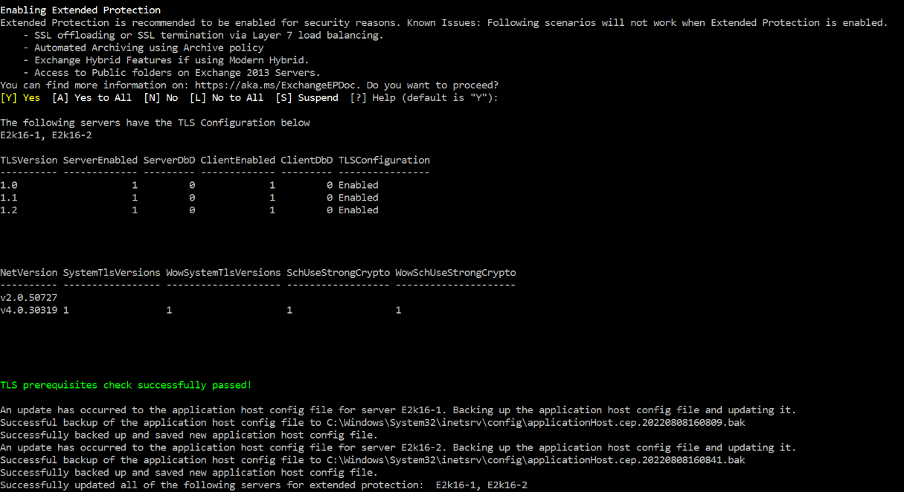
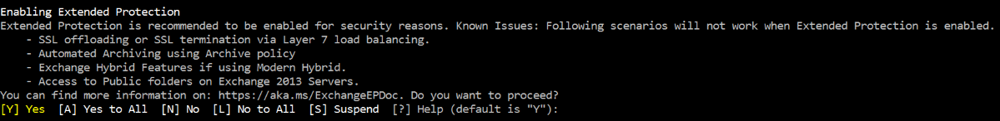
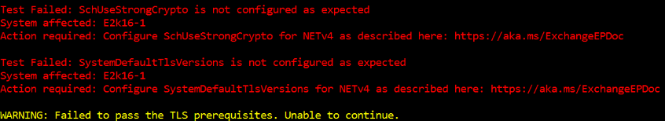
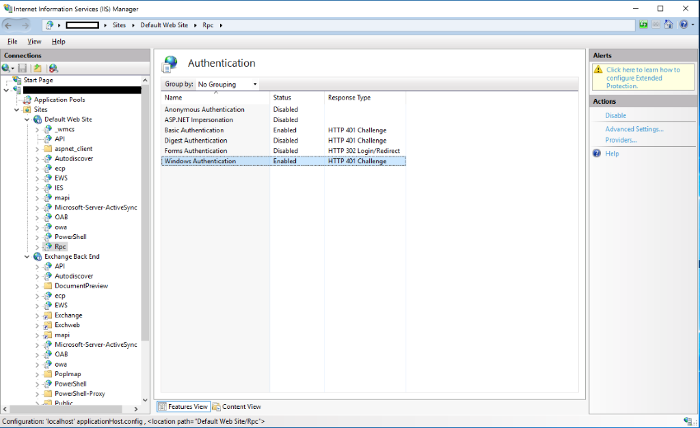
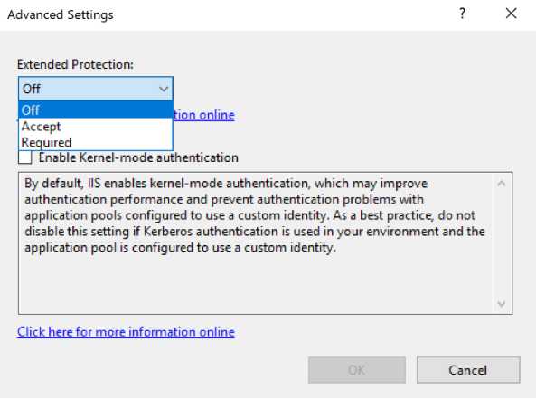
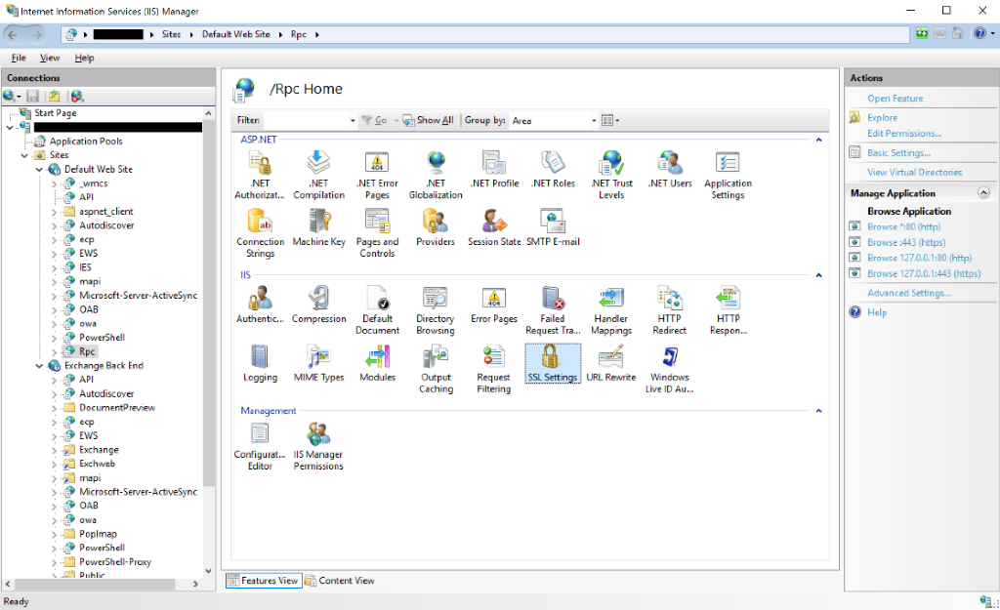
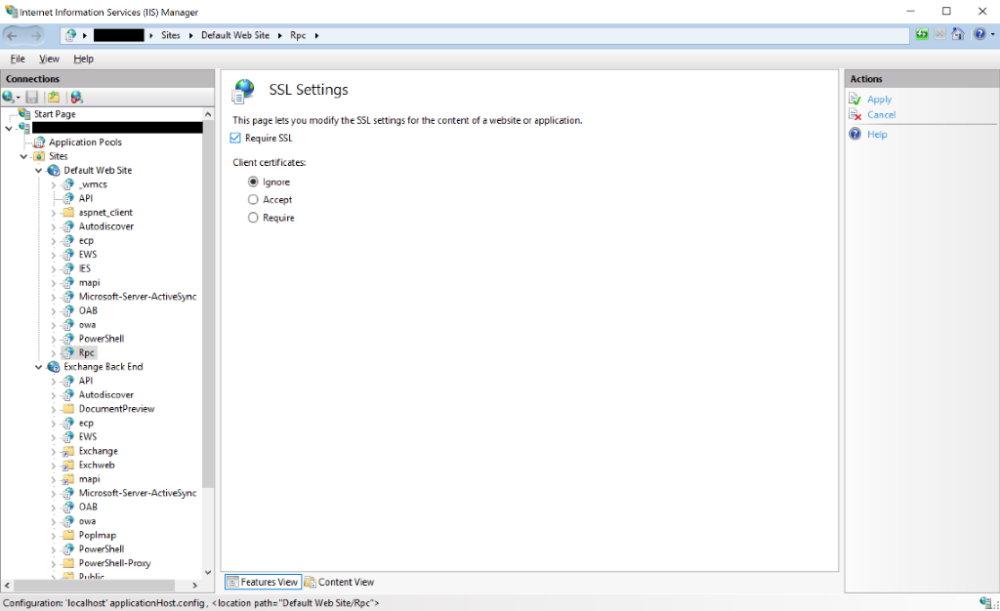

# Exchange Server Support for Windows Extended Protection

## Overview

[Windows Extended Protection](https://docs.microsoft.com/iis/configuration/system.webserver/security/authentication/windowsauthentication/extendedprotection/) enhances the existing authentication in Windows Server and mitigates authentication relay or "man in the middle" (MitM) attacks. This mitigation is accomplished by using security information that is implemented through Channel-binding information specified through a Channel Binding Token (CBT) which is primarily used for SSL connections.

Windows Extended Protection is supported on Exchange Server 2013, 2016 and 2019 starting with the [August 2022 Exchange Server Security Update (SU) releases](https://techcommunity.microsoft.com/t5/exchange-team-blog/released-august-2022-exchange-server-security-updates/ba-p/3593862).

While Extended Protection can be enabled on each virtual directory manually, we have provided a script that can help you accomplish this in bulk. Windows Extended Protection is supported on Exchange Server 2013, 2016 and 2019 starting with the [August 2022 Exchange Server Security Update (SU) releases](https://techcommunity.microsoft.com/t5/exchange-team-blog/released-august-2022-exchange-server-security-updates/ba-p/3593862).

## Terminology used in this document

**Virtual Directory, or vdir,** is used by Exchange Server to allow access to web applications such as Exchange ActiveSync, Outlook on the Web, and the Autodiscover service. Several virtual directory settings can be configured by an admin, including authentication, security, and reporting settings. Extended Protection is one such authentication setting.

**The Extended Protection setting** controls the behavior for checking of CBTs. Possible values for this setting are listed in the following table:

| **Extended Protection Setting** | **Description**                                                                                                                                                                                                                 |
| ------------------------------- | ------------------------------------------------------------------------------------------------------------------------------------------------------------------------------------------------------------------------------- |
| None                            | Specifies that IIS will not perform CBT checking.                                                                                                                                                                              |
| Allow                           | Specifies that CBT checking is enabled, but not required. This setting allows secure communication with clients that support extended protection, and still supports clients that are not capable of using extended protection. |
| Require                         | This value specifies that CBT checking is required. This setting blocks clients that do not support extended protection.                                                                                                       |

**SSL Flags**: Configuration of SSL settings is required to ensure that clients connect to IIS virtual directories in a specific way with client certificates. To enable Extended Protection, the required SSL flags are SSL and SSL128.

**SSL offloading** terminates the connection on a device between the client and the Exchange Server and then uses a non-encrypted connection to connect to the Exchange Server.

Example:

*Client --[HTTPS]-\> [Device (e.g., Load Balancer) terminates the connection] --[HTTP]-\> Web Server*

**SSL bridging** is a process where a device, usually located at the edge of a network, decrypts SSL traffic, and then re-encrypts it before sending it on to the Web server.

Example:

*Client --[HTTPS]-\> [Device (e.g., Load Balancer) terminates the connection] --[HTTPS]-\> Web Server*

**Modern Hybrid** or **Hybrid Agent** is a mode of configuring Exchange Hybrid that removes some of the configuration requirements for Classic Hybrid (like Inbound network connections through your firewall) to enable Exchange hybrid features. You can learn more about this [here](https://docs.microsoft.com/exchange/hybrid-deployment/hybrid-agent).

**Public Folders** are designed for shared access and to help make content in a deep hierarchy easier to browse. You can learn more about Public Folders [here](https://docs.microsoft.com/exchange/collaboration/public-folders/public-folders?view=exchserver-2019).

## Prerequisites for enabling Extended Protection on Exchange servers

### Make sure you are on the correct versions

Extended Protection is supported on Exchange Server 2013 CU23 and Exchange Server 2016 CU22 and Exchange Server 2019 CU11 or later with the August 2022 Security Updates installed.

If your organization has Exchange Server 2016 or Exchange Server 2019 installed, it must be running either the [September 2021 Quarterly Exchange Updates](https://techcommunity.microsoft.com/t5/exchange-team-blog/released-september-2021-quarterly-exchange-updates/ba-p/2779883) (CU) with the August 2022 Security Update (SU) or later installed or the [2022 H1 Cumulative Update](https://techcommunity.microsoft.com/t5/exchange-team-blog/released-2022-h1-cumulative-updates-for-exchange-server/ba-p/3285026) (CU) with the August 2022 Security Update (SU) or later installed.

If your organization has Exchange Server 2013 installed, it must be running [CU23](https://www.microsoft.com/download/details.aspx?id=58392) with the August 2022 SU (or later) installed.

You **must** ensure **all** your Exchange servers are on the required CU and have the August 2022 SU (or later) before you proceed further.

### Extended Protection cannot be enabled on Exchange Server 2013 servers with Public Folders in a coexistence environment

To enable Extended Protection on Exchange Server 2013, ensure you do not have any Public Folders on Exchange Server 2013. If you have coexistence of Exchange Server 2013 with Exchange Server 2016 or Exchange Server 2019, you must migrate your Public Folders to 2016 or 2019 **before** enabling Extended Protection. After enabling Extended Protection, if there are Public Folders on Exchange 2013, they will no longer appear to end users.

### Extended Protection cannot be enabled on Exchange Server 2016 CU22 or Exchange Server 2019 CU11 or older that hosts a Public Folder Hierarchy

If you have an environment containing Exchange Server 2016 CU22 or Exchange Server 2019 CU11 or older and are utilizing Public Folders, before enabling extended protection **you must confirm the version of the server hosting the Public Folder hierarchy**. Ensure the server hosting the Public Folder hierarchy is upgraded to Exchange Server 2016 CU23 or Exchange Server 2019 CU12 with the latest Security Updates or move the hierarchy to one with these latest versions and updates.

### Extended Protection does not work with hybrid servers using Modern Hybrid configuration

Extended Protection cannot be enabled on Hybrid Servers which uses Modern Hybrid configuration. In Modern Hybrid configuration, Hybrid Server are published to Exchange Online via Hybrid Agent which proxies the Exchange Online call to Exchange Server.

Enabling Extended Protection on Hybrid servers using Modern Hybrid configuration will lead to disruption of hybrid features like mailbox migrations and Free/Busy. Hence, it is important to identify all the Hybrid Servers in the organization published via Hybrid Agent and not enable Extended Protection specifically on these servers.

#### Identifying hybrid Exchange servers published using Hybrid Agent

**Note**: This step is not required if you are using classic Hybrid configuration.

In case you don’t have a list of servers published via Hybrid Agent, you can use the following steps to identify them:

1. Log into a machine where the Hybrid Agent is installed and running. Open the [PowerShell module](https://docs.microsoft.com/exchange/hybrid-deployment/hybrid-agent#hybrid-agent-powershell-module) of the Hybrid Agent and run *Get-HybridApplication* to identify the *TargetUri* used by the Hybrid Agent.  
2. The *TargetUri* parameter gives you the FQDN of the Exchange Server that is configured to use Hybrid Agent.  
    1. Deduce the Exchange Server identity using the FQDN and make a note of this Exchange Server.  
    2. If you are using a Load Balancer URL in *TargetUri*, you need to identify all the Exchange servers running the Client Access role behind the load balancer URL.  

Extended Protection **should not be enabled for hybrid servers that are published using Hybrid Agent**. You need to identify these hybrid servers and ensure you skip enabling Extended Protection on them using the SkipExchangeServerNames parameter of the script.  

#### Steps to safeguard hybrid servers using Modern Hybrid

1. Inbound connections to Exchange servers in a Modern Hybrid configuration should be restricted via firewall to allow connections only from Hybrid Agent machines.  
2. No mailboxes should be hosted on the hybrid server, and if any mailbox exists, they should be migrated to other mailbox servers.  
3. You can enable Extended Protection on all virtual directories except Front End EWS on the hybrid Exchange server.  

    **Note**: Specifically skipping extended protection on Front End EWS of Exchange Server is not supported via script. So, you would need to change this setting manually.  

### SSL Offloading scenarios are not supported

Extended Protection is not supported in environments that use SSL offloading. SSL termination during SSL offloading causes Extended Protection to fail. To enable Extended Protection in your Exchange environment, **you must not be using SSL offloading** with your Load Balancers.

**Note:** We will provide additional guidance for this scenario in the near future.

### TLS configuration must be consistent across all Exchange servers

Before enabling Extended Protection, you must ensure that all TLS configurations are consistent across all Exchange servers. For example, if one of the servers uses TLS 1.2, you must ensure that all the servers in the organization are configured using TLS 1.2. Any variation in TLS version use across servers can cause client connections to fail.

In addition to this, the value of *SchUseStrongCrypto* registry key should be either set to 1 (recommended) or 0 across all the Exchange Servers in the organization. If this value is not explicitly set, the default value of this key may be interpreted as 0 or 1 depending on the .NET version in use by the Exchange binaries. This can cause TLS mismatch, leading to client connectivity issues.

Please refer to this [guide](https://docs.microsoft.com/Exchange/exchange-tls-configuration?view=exchserver-2019) to configure the required TLS settings on your Exchange servers.

### Third-party software compatibility

Please ensure to test all third-party products in your Exchange Server environment to ensure that they work properly when Extended Protection is enabled.

## Enabling Extended Protection

Extended Protection can be enabled manually through IIS Manager or via a script (strongly recommended). To correctly configure Extended Protection, each virtual directory on all Exchange servers in the organization (excluding Edge Transport servers) should be set to prescribed value of Extended Protection as well as sslFlags. The following table summarizes the settings needed for each virtual directory on the supported versions of Microsoft Exchange.

Enabling Extended Protection involves making many changes on all Exchange servers, so **we strongly recommend using the ExchangeExtendedProtectionManagement.ps1 script** that can be downloaded from <https://aka.ms/ExchangeEPScript>.

| IIS Website      | Virtual Directory           | Recommended Extended Protection | Recommended sslFlags        |
| ---------------- | --------------------------- | ------------------------------- | --------------------------- |
| Default Website  | API                         | Required                        | Ssl,Ssl128                  |
| Default Website  | AutoDiscover                | Off                             | Ssl,Ssl128                  |
| Default Website  | ECP                         | Required                        | Ssl,Ssl128                  |
| Default Website  | EWS                         | Accept (UI) /Allow (Script)     | Ssl,Ssl128                  |
| Default Website  | MAPI                        | Required                        | Ssl,Ssl128                  |
| Default Website  | Microsoft-Server-ActiveSync | Accept (UI) /Allow (Script)     | Ssl,Ssl128                  |
| Default Website  | OAB                         | Required                        | Ssl,Ssl128                  |
| Default Website  | OWA                         | Required                        | Ssl,Ssl128                  |
| Default Website  | PowerShell                  | Required                        | SslNegotiateCert            |
| Default Website  | RPC                         | Required                        | Ssl,Ssl128                  |
| Exchange Backend | API                         | Required                        | Ssl,Ssl128                  |
| Exchange Backend | AutoDiscover                | Off                             | Ssl,Ssl128                  |
| Exchange Backend | ECP                         | Required                        | Ssl,Ssl128                  |
| Exchange Backend | EWS                         | Required                        | Ssl,Ssl128                  |
| Exchange Backend | Microsoft-Server-ActiveSync | Required                        | Ssl,Ssl128                  |
| Exchange Backend | OAB                         | Required                        | Ssl,Ssl128                  |
| Exchange Backend | OWA                         | Required                        | Ssl,Ssl128                  |
| Exchange Backend | PowerShell                  | Required                        | Ssl,SslNegotiateCert,Ssl128 |
| Exchange Backend | RPC                         | Required                        | Ssl,Ssl128                  |
| Exchange Backend | PushNotifications           | Required                        | Ssl,Ssl128                  |
| Exchange Backend | RPCWithCert                 | Required                        | Ssl,Ssl128                  |
| Exchange Backend | MAPI/emsmdb                 | Required                        | Ssl,Ssl128                  |
| Exchange Backend | MAPI/nspi                   | Required                        | Ssl,Ssl128                  |

### Enabling Extended Protection using the script

Before enabling Extended Protection in your Exchange environment, ensure you meet all the prerequisites listed in this document.

To enable Extended Protection on all your Exchange Servers, you can use the [ExchangeExtendedProtectionManagement.ps1](https://aka.ms/ExchangeEPScript) script, which is hosted on the Microsoft Exchange-CSS repository on GitHub.

It’s not required to run the script directly on any specific Exchange Server in your environment. Just copy it to a machine that has the Exchange Management Shell (EMS) installed.

**Note** Over time, we will be updating the script and documentation. The script will attempt to auto-update when it is run. If the computer where the script is run is not connected to the Internet, this update check will fail. You should always check for the latest version of the script before running it.

#### Parameters

If the script is executed without any parameters, it will enable Extended Protection on any Exchange Server that can be reached from the machine where the script was run. You can use the following parameters to specify the scope of script operations:

| Parameter               | Usage                                                                                                                                                                                                                                                         |
| ----------------------- | ------------------------------------------------------------------------------------------------------------------------------------------------------------------------------------------------------------------------------------------------------------- |
| ExchangeServerNames     | Used to specify which Exchange servers should be **included in the scope of script execution**. It can be either a single Exchange server hostname or a comma separated list of hostnames. Parameter values: **Exchange Server Hostname (NetBIOS or FQDN)**   |
| SkipExchangeServerNames | Used to specify which Exchange servers should be **excluded from the scope of script execution**. It can be either a single Exchange Server hostname or a comma separated list of hostnames. Parameter values: **Exchange Server Hostname (NetBIOS or FQDN)** |
| RollbackType            | Used to revert changes made by the Extended Protection script. Parameter Values: **"RestoreIISAppConfig**"                                                                                                                                                    |
| ShowExtendedProtection  | Used to display the current Extended Protection configuration state in your organization or on a specific computer (use the *ExchangeServerNames* or *SkipExchangeServerNames* parameter to show the configuration for a subset of Exchange servers).        |

#### Enabling Extended Protection on all Exchange servers

After copying the script to a suitable machine, create a directory to store the script and move the script there. Then open the Exchange Management Shell (EMS) and go to the respective directory where the script is stored.

Make sure that the account you are using is a member of the **Organization Management** role group.

Execute the script as follows:

`.\ExchangeExtendedProtectionManagement.ps1`

In case that you have Modern Hybrid configuration, you need to skip Exchange servers published using the Hybrid Agent. This can be done by using the *SkipExchangeServerNames* parameter:

`.\ExchangeExtendedProtectionManagement.ps1 -SkipExchangeServerNames HybridServer1, HybridServer2`

The script will check to ensure that all Exchange servers in scope have the minimum CU and SU required to enable Extended Protection.

The script will also check if all Exchange servers in scope have the same TLS configuration. An inconsistent (or invalid) TLS configuration will cause client connections or connections to Exchange Online to fail.

After the prerequisites checks have been passed, the script will enable Extended Protection and add the required SSL flags on all virtual directories of all Exchange servers in scope.

  

#### Troubleshooting warnings and errors during script execution

1. **Script gives a cursory warning of known issues before enabling Extended Protection**  
    To prevent a scenario where existing Exchange functions are disrupted due to enabling Extended Protection, the script provides a list of scenarios that have known issues. You should **read and evaluate this list carefully** before enabling Extended Protection.  
    You can proceed to turn on Extended Protection by pressing Y.  
      
2. **Script does not enable Extended Protection because of Failed Prerequisite Check**  
    1. No Exchange server runs an Extended Protection supported build:  
        If no Exchange server in the organization is running a CU that supports Extended Protection, the script will not enable Extended Protection on unsupported servers thereby ensuring server-to-server communication does not fail.  
        To resolve this, upgrade all servers to the latest CU and SU and re-run the script to enable Extended Protection.  
    2. TLS mismatch  
            A valid and consistent TLS configuration is required on all Exchange servers in scope. If the TLS settings on all servers in scope are not the same, enabling Extended Protection will disrupt client connections to mailbox servers.  
              
            To resolve this, configure the TLS settings on all servers in the organization to be the same and then re-run the script. You can find an overview of the Exchange Server TLS configuration best practices [here](https://docs.microsoft.com/Exchange/exchange-tls-configuration).  
3. **Some Exchange servers are not reachable**  
    **Cause**  
    The script performs multiple tests against all Exchange servers in scope. If one or more of these servers aren’t reachable, the script will exclude them and not configure Extended Protection on them.  
      
    If the server is offline, you should enable Extended Protection on it once it is back online. If the server was unreachable for other reasons, you should run the script directly on the servers to enable Extended Protection.  

#### Rolling back Extended Protection settings

You can also use the script to roll back the Extended Protection settings from one or more servers. When Extended Protection settings are modified by the script, an applicationHost.cep.\*.bak file is created on each server, which contains a backup of pre-existing settings before the script is run. Those files are going to be local to each individual server that the script modifies. Therefore, the rollback of Extended Protection settings can be rolled back from any machine where the script will run using the *earliest* version of the .bak file to roll back the changes. The following command initiates a rollback of Extended Protection on any Exchange server where it was enabled using the script:

`.\ExchangeExtendedProtectionManagement.ps1 –RollbackType "RestoreIISAppConfig"`

### Enabling Extended Protection manually via IIS settings

If you want to enable Extended Protection in your environment manually without using the script, you can use the following steps.

**Note** When manually enabling Extended Protection, ensure that all virtual directories on the Exchange servers have Extended Protected configured according to the table above.

#### Set Extended Protection to either Required or Accept for an Exchange Virtual Directory

1. Launch IIS Manager on the Exchange server where you want to configure Extended Protection.  
2. Go to Sites and select either the *Default Web Site* or *Exchange Back End.*  
3. Select the Virtual Directory for which you want to change.  
4. Go to *Authentication.*  
5. If Windows Authentication is enabled, then select *Windows Authentication.*  
      
6. Select *Advanced Settings* (on the right side) and in Advanced Settings window, select the suitable value from the *Extended Protection Dropdown.*  
      

#### Set Require SSL settings to either Required or Accept for an Exchange Virtual Directory

1. Go to the Virtual Directory’s home page.  
      
2. Go to *SSL Settings*.  
3. Check the *Require SSL* checkbox to make sure that Require SSL is enabled for this Virtual Directory.  
4. Click *Apply*.  
      

## Known issues and workarounds

1. Customers using a *Retention Policy* containing *Retention Tags* which perform *Move to Archive* actions should not configure Extended Protection, as enabling Extended Protection will cause automated archiving to stop working. We are actively working to resolve this issue.  
2. In Exchange Server 2013, one of the MAPI over HTTP probes (OutlookMapiHttpCtpProbe, used to check if the MAPI/HTTP endpoint is working on the Mailbox server) can show false *FAILED* status after enabling Extended Protection.  

    For example: running Test-OutlookConnectivity -ProbeIdentity OutlookMapiHttp.Protocol\OutlookMapiHttpCtpProbe may show the probe as failed, although Outlook functionality is working properly.  

## Troubleshooting issues after enabling Extended Protection

### Users cannot access their mailbox through one or more clients

There may be multiple reasons why some or all clients may start giving authentication errors to users after enabling Extended Protection. If this happens, check the following:  

1. If the TLS configuration across the Exchange organization is not the same (e.g., the TLS configuration was changed on one of the Exchange servers after Extended Protection was enabled), this may cause client connections to fail. To resolve this, refer to earlier instructions to configure the same TLS version across all Exchange servers and then use the script to configure Extended Protection again.  
2. Check if SSL offload is enabled. Any SSL termination causes the Extended Protection to fail for client connections. Usually if this is the case, users will be able to access their mailbox using Outlook on the Web but Outlook for Windows, Mac or mobile will fail.  
    To resolve this issue, disable SSL offloading and then use the script to configure Extended Protection.  
3. Users can access their emails using Outlook for Windows and Outlook on the Web, but not through non-Windows clients like Outlook for Mac, Outlook on iOS, the iOS native email app, etc. This can happen if the Extended Protection setting for EWS and/or Exchange ActiveSync is set to **Required** on one or all Front-End servers.  
    To resolve this issue, either run the ExchangeExtendedProtectionManagement.ps1 script with the –ExchangeServerNames parameter and pass the name of the Exchange server which has the problem. You can also run the script without any parameter and configure Extended Protection for all servers.  

    `.\ExchangeExtendedProtectionManagement.ps1`  

    or  

    `.\ExchangeExtendedProtectionManagement.ps1 -ExchangeServerNames Server1, Server2`  

    Alternatively, you can also use InetMgr.exe and change the Extended Protection setting for those virtual Directories to the "Accept" value. However, we recommend using the script as it checks for the correct values and automatically performs a reconfiguration if the values are not set as expected.  
4. If after doing the above, some clients are still not working properly, you can roll back Extended Protection temporarily and report the issue to us. If script was used to configure Extended Protection, you can use the *-RollbackType "RestoreIISAppConfig"* parameter to revert any changes. If Extended Protection was enabled manually (through IIS Manager) you need to revert the settings manually.  

### Hybrid Free/Busy or mailbox migration is not working

If you are using Modern Hybrid or the Hybrid Agent enabling Extended Protection will cause Hybrid features like Free/Busy and mailbox migration to stop working. To resolve this issue, identify the hybrid servers that are published using Hybrid Agent and disable Extended Protection on the Front-End EWS endpoints for these servers.

### Public Folders are not accessible

There are two issues that currently impact Public Folders Connectivity:

#### Exchange 2013

If Public Folders exist on Exchange 2013 servers and Extended Protection is enabled, they will no longer appear and end users will be unable to access them. To resolve the issue in a coexistence environment, migrate all Public Folders to Exchange Server 2016 or Exchange Server 2019. If you have an environment containing only Exchange 2013 servers with Public Folders, you can manually remove the SSL flag from the Backend RPC virtual directory to make Public Folders accessible.

#### Exchange Server 2016 CU22 / Exchange Server 2019 CU11 or Older

If you have an environment containing Exchange Server 2016 CU22 or Exchange Server 2019 CU11 or older and are utilizing Public Folders, before enabling extended protection you must confirm the version of the server hosting the Public Folder hierarchy. **Ensure the server hosting the Public Folder hierarchy is upgraded to Exchange Server 2016 CU23 or Exchange Server 2019 CU12 with the latest Security Updates** or move the hierarchy to one with these latest versions and updates.
